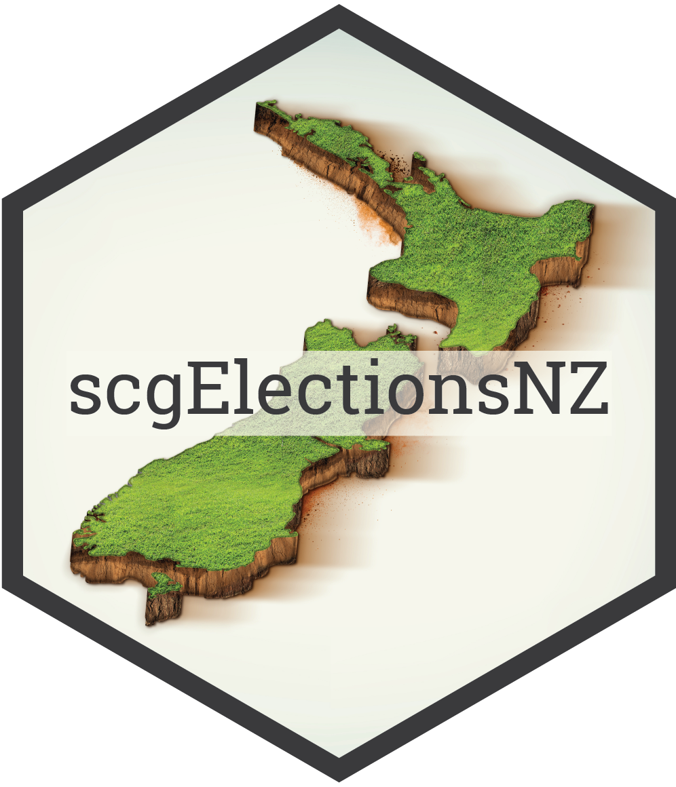

scgElectionsNZ <a href="https://sarahcgall.github.io/scgElectionsNZ/"></a>
================
<!-- badges: start -->
[](https://github.com/sarahcgall/scgElectionsNZ/blob/master/NEWS.md)
[](https://github.com/sarahcgall/scgElectionsNZ/actions/workflows/R-CMD-check.yaml)
[](https://codecov.io/gh/sarahcgall/scgElectionsNZ)
<!-- badges: end -->

## Overview

`scgElectionsNZ` is an R package which provides data and functions for
exploring New Zealand’s general election results. All data are from elections occuring between 1996 and 2023, unless stated otherwise.

This package provides the following datasets:

* `summary`: overall results at the national-level by party
* `turnout`: turnout and informal vote by electorate and ballot type (candidate and party)
* `vote_type`: valdidity and vote type by electorate and ballot type (candidate and party)
* `party_votes`: party vote by electorate and party (electorate-level)
* `candidate_votes`: candidate vote by electorate and party (electorate-level)
* `majority`: winning candidate and margin of victory by electorate (electorate-level)
* `split_total`: split-ticket voting (2005 - 2023 only) - the number of voters who cast their party vote for a different party to their candidate vote (national-level by party)
* `preMMP_results`: overall results between 1890 and 1993 (prior to the introduction of MMP) (national-level by party)
* `historic_turnout`: turnout between 1879 and 2023 (national-level by year)

## Installation

The code below relies on the development version of `scgElectionsNZ`.
Install it with:

``` r
devtools::install_github("sarahcgall/scgElectionsNZ")
```

## Usage
In addition to the datasets listed above, a number of helper functions exist to aid in the analysis of the data. These include:

* `add_region()`: adds a Regions column (e.g., Auckland, Northland, Waikato, etc.) against a dataset containing electorates.
* `add_type()`: adds an Electorate_Type column (i.e., General or Maori) against a dataset containing electorates.
* `update_EName()`: this function converts pre-2020 electorate names to match post-2020 electorate names so that seats can 
be tracked from 1996 until 2023 with one exception of Waipareira which merged with Waitakere in 1999 but then split into Kelston and Upper Harbour.

``` r
# Load datasets by using the following helper function:
df <- get_data("majority")
# Alternatively, use: 
data("majority")

# Add a region column to dataset
df <- add_region(df)

# Add a electorate type column to dataset
df <- add_type(df)

# Convert pre-2020 electorate names to match name changes that occurred in 2020
df <- update_EName(df, column=Electorate)
```

For more in-depth examples of using each dataset included in the `scgElectionsNZ` package, view the data index 
[here](https://sarahcgall.github.io/scgElectionsNZ/reference/index.html) or view the articles found at:
https://sarahcgall.github.io/scgElectionsNZ.

## Data Sources
The election data available within the `scgElectionsNZ` package can be found in the tables below.
Data have been sourced from the [New Zealand Electoral Commission](https://electionresults.govt.nz/) and are 
up-to-date as at 3 December, 2023.

## Future Additions and Updates
Additional datasets will include by-election data and the following datasets:

* `results_by_booths`: TBC 
* `split_electorate`: split voting by electorate (2005 - 2023 only)

In future updates, the following functions will be added:

* `amend_boundary`: a function to convert boundaries into current boundaries for a better comparison across multiple elections (this will replace the `update_EName`
function which is ok for general tracking of electorates but not for statistical purposes)
* `plot_parliament`: a function to visualise the number of seats (parliament graph)
* `plot_cartogram`: a function to visualise the vote by electorate (cartogram)

For any suggested additions or amendments, please get in touch!

## Other Packages
* [`scgUtils`](https://github.com/sarahcgall/scgUtils): a package which provides functions and plotting capabilities
