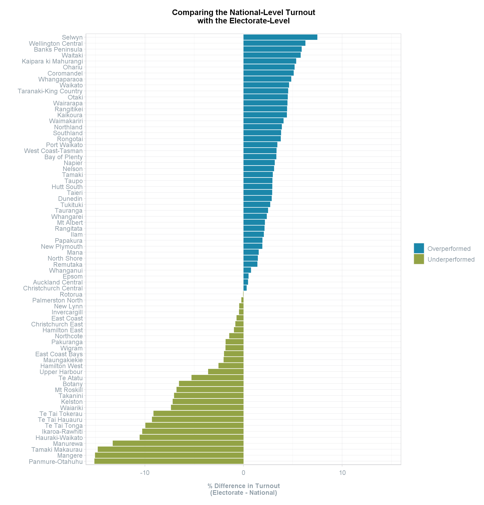
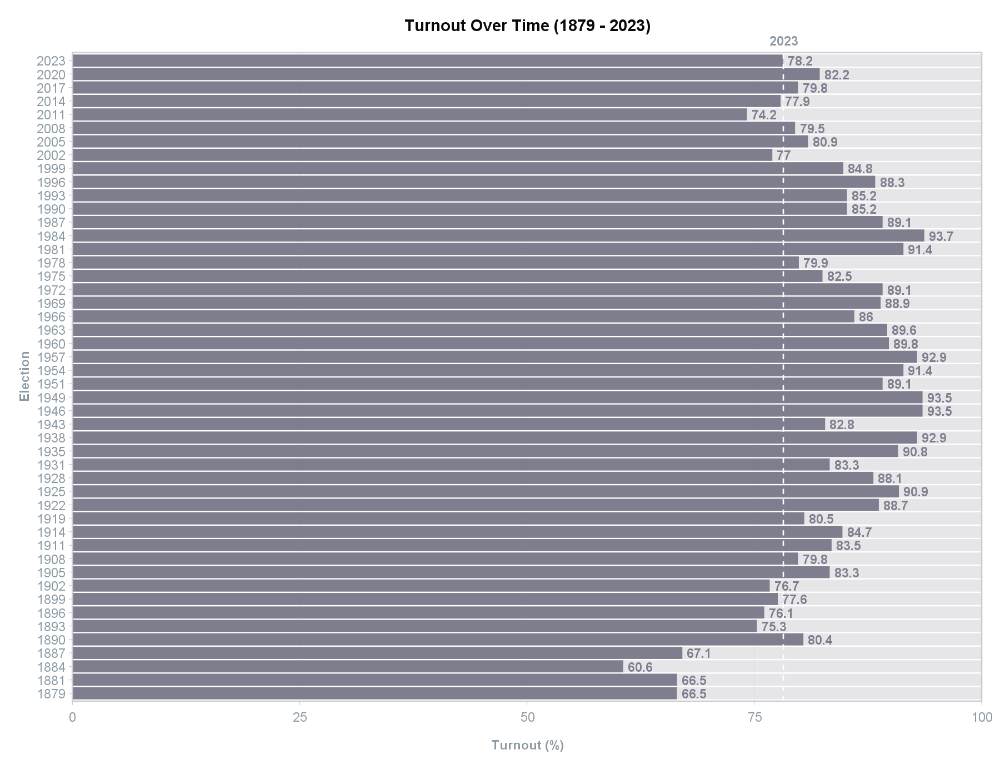

scgElectionsNZ
================

## Overview

`scgElectionsNZ` is an R package which provides data and functions for
exploring New Zealand’s general election results. All data are from elections occuring between 1996 and 2023, unless stated otherwise.

This package provides the following datasets: 
* `summary`: overall results at the national-level by party
* `turnout`: turnout and informal vote by electorate and ballot type (candidate and party)
* `vote_type`: valdidity and vote type by electorate and ballot type (candidate and party)
* `party_votes`: party vote by electorate and party (electorate-level)
* `candidate_votes`: candidate vote by electorate and party (electorate-level)
* `majority`: winning candidate and margin of victory by electorate (electorate-level)
* `split_total`: split-ticket voting (2005 - 2023 only) - the number of voters who cast their party vote for a different party to their candidate vote (national-level by party)
* `preMMP_results`: overall results between 1890 and 1993 (prior to the introduction of MMP) (national-level by party)
* `historic_turnout`: turnout between 1879 and 2023 (national-level by year)

## Installation

The code below relies on the development version of `scgElectionsNZ`.
Install it with:

``` r
devtools::install_github("sarahcgall/scgElectionsNZ")
```

## Usage
In addition to the datasets listed above, a number of helper functions exist to aid in the analysis of the data. These include:
* `get_data()`: provides ability to save dataset with a name of your choosing.
* `add_region()`: adds a Regions column (e.g., Auckland, Northland, Waikato, etc.) against a dataset containing electorates.
* `add_type()`: adds an Electorate_Type column (i.e., General or Maori) against a dataset containing electorates.
* `update_EName()`: this function converts pre-2020 electorate names to match post-2020 electorate names so that seats can 
be tracked from 1996 until 2023 with one exception of Waipareira which merged with Waitakere in 1999 but then split into Kelston and Upper Harbour.

``` r
# Load datasets by using the following helper function:
df <- get_data("majority")
# Alternatively, use: 
data("majority")

# Add a region column to dataset
df <- add_region(df)

# Add a electorate type column to dataset
df <- add_type(df)

# Convert pre-2020 electorate names to match name changes that occurred in 2020
df <- update_EName(df, column=Electorate)
```

## Dataset Contents
The datasets have been divided into categories based on intended use of the data and contain election data from across 
all elections years for ease of comparison. In addition, all special characters have been removed from the data (e.g., 
M&amacr;ori is now Maori) and party names have been standardised across elections. A full list of amended party names 
can be found in data-raw\utils.R.

The column names within these datasets are uniform for ease of combining multiple datasets together (see table below).

| Column Name            | Column Type    | `summary` | `turnout` | `vote_type` | `party_votes`<sup>1</sup> | `candidate_votes` | `majority` | `split_total`<sup>1</sup> | `preMMP_results` | `historic_turnout` |
|:-----------------------|----------------|:---------:|:---------:|:-----------:|:-------------------------:|:-----------------:|:----------:|:-------------------------:|:----------------:|:------------------:|
| Election               | Numeric (year) | &#10004;  | &#10004;  |  &#10004;   |         &#10004;          |     &#10004;      |  &#10004;  |         &#10004;          |     &#10004;     |      &#10004;      |
| Ballot<sup>2</sup>     | Character      | &#10004;  | &#10004;  |  &#10004;   |         &#10004;          |     &#10004;      |            |                           |                  |                    |
| MPs                    | Numeric (n)    |           |           |             |                           |                   |            |                           |                  |      &#10004;      |
| Electorate             | Character      |           | &#10004;  |  &#10004;   |         &#10004;          |     &#10004;      |  &#10004;  |         &#10004;          |                  |                    |
| Electors               | Numeric (n)    |           | &#10004;  |             |                           |                   |            |                           |                  |      &#10004;      |
| Turnout                | Numeric (%)    |           | &#10004;  |             |                           |                   |            |                           |                  |      &#10004;      |
| Total<sup>3</sup>      | Numeric (n)    |           | &#10004;  |             |                           |                   |            |                           |                  |                    |
| Informal               | Numeric (n)    |           | &#10004;  |             |                           |                   |            |                           |                  |                    |
| Validity               | Character      |           |           |  &#10004;   |                           |                   |            |                           |                  |                    |
| Vote_Type              | Character      |           |           |  &#10004;   |                           |                   |            |                           |                  |                    |
| Party                  | Character      | &#10004;  |           |             |         &#10004;          |     &#10004;      |  &#10004;  |                           |     &#10004;     |                    |
| List_Party             | Character      |           |           |             |                           |                   |            |         &#10004;          |                  |                    |
| Electorate_Party       | Character      |           |           |             |                           |                   |            |         &#10004;          |                  |                    |
| Candidate<sup>4</sup>  | Character      |           |           |             |                           |                   |  &#10004;  |                           |                  |                    |
| Seats                  | Numeric (n)    | &#10004;  |           |             |                           |                   |            |                           |     &#10004;     |                    | 
| Votes                  | Numeric (n)    | &#10004;  |           |  &#10004;   |         &#10004;          |     &#10004;      |            |         &#10004;          |                  |                    | 
| Percentage             | Numeric (%)    | &#10004;  |           |             |                           |     &#10004;      |            |         &#10004;          |     &#10004;     |                    |
| Party_List<sup>5</sup> | Character      |           |           |             |                           |                   |  &#10004;  |                           |                  |                    |
| Nominated<sup>6</sup>  | Character      | &#10004;  |           |             |                           |                   |            |                           |                  |                    |
| Registered<sup>7</sup> | Character      | &#10004;  |           |             |                           |                   |            |                           |                  |                    |
| Successful<sup>8</sup> | Character      | &#10004;  |           |             |                           |                   |            |                           |                  |                    |

1 Dataset includes Informal Votes under Party column.<br>
2 Ballot includes "Party", "Candidate", or "Total" (Party + Candidate for Seats or Party only for Vote/Percentage).<br>
3 Total refers to the total number of votes cast (Valid + Informal).<br>
4 Candidate column contains the name of the winning candidate for that electorate.<br>
5 Party_List column contains Yes or No values and refers to whether the candidate running in the electorate is also on the Party List.<br> 
6 Nominated column refers to the number of candidates nominated as electorate candidates or the number on a party list depending on Vote_Type.<br>
7 Registered column contains Yes or No values and refers to whether the party is a registered party with a list or an unregistered party without a list.<br>
8 Successful column contains Yes or No values and refers to whether or not a party achieved the 5% Party_Vote threshold or won at least one electorate.<br>

## Examples

#### Summary
The `summary` dataset contains the overall results at the national-level by Election, Ballot,
and Party. It can be used to find the number of seats, votes (n + %), and nominations/on party list by ballot type - 
Candidate Vote, Party Vote, or Total (Seats column = Candidate + Party; Vote column = Party only). It can also be used to
find the number of overhang seats and which party these can be attributed to. 

*NB overhang seats occur when the Party Vote entitles that party to fewer seats than the number of electorate seats that it won.*

``` r
library(scgElectionsNZ)
library(tidyverse)

# Load datasets by using the following helper function:
df <- get_data("summary")
# Alternatively, use: data("summary")

# View the Party Vote and Candidate Vote for 2023
df %>%
  filter(Ballot != "Total", Election == 2023) %>%
  arrange(-Percentage)
#    Election    Ballot                            Party Seats   Votes Percentage Nominated Registered Successful
# 1      2023 Candidate                   National Party    43 1192251      43.47        67        Yes        Yes
# 2      2023     Party                   National Party     5 1085851      38.08        74        Yes        Yes
# 3      2023 Candidate                     Labour Party    17  855963      31.21        72        Yes        Yes
# 4      2023     Party                     Labour Party    17  767540      26.92        76        Yes        Yes
# 5      2023     Party                      Green Party    12  330907      11.61        49        Yes        Yes
# 6      2023     Party                        ACT Party     9  246473       8.64        60        Yes        Yes
# 7      2023 Candidate                      Green Party     3  226575       8.26        52        Yes        Yes
# 8      2023     Party                         NZ First     8  173553       6.09        35        Yes        Yes
# 9      2023 Candidate                        ACT Party     2  149507       5.45        59        Yes        Yes
# 10     2023 Candidate                      Maori Party     6  106584       3.89        17        Yes        Yes
# ...

# View the Party Vote (%) of succesful parties only to determine where the overhang seats in 2023 can be attributed to
df %>%
  filter(Successful == "Yes", Ballot == "Total", Election == 2023) %>%
  group_by(Election) %>%
  mutate(`%` = Votes/sum(Votes)*100) %>%
  ungroup() %>%
  mutate(Overhang = Seats-round(120*`%`/100,0))
# A tibble: 6 x 11
#   Election Ballot Party          Seats   Votes Percentage Nominated Registered Successful   `%` Overhang
#      <dbl> <chr>  <chr>          <int>   <dbl>      <dbl>     <int> <chr>      <chr>      <dbl>    <dbl>
# 1     2023 Total  ACT Party         11  246473       8.64       119 Yes        Yes         9.16        0
# 2     2023 Total  Green Party       15  330907      11.6        101 Yes        Yes        12.3         0
# 3     2023 Total  Labour Party      34  767540      26.9        148 Yes        Yes        28.5         0
# 4     2023 Total  Maori Party        6   87844       3.08        48 Yes        Yes         3.26        2
# 5     2023 Total  NZ First           8  173553       6.09        69 Yes        Yes         6.45        0
# 6     2023 Total  National Party    48 1085851      38.1        141 Yes        Yes        40.3         0

# Plot the number of seats won by party at each election
df %>%
  filter(Successful == "Yes", Ballot == "Total") %>% # remove parties which did not win a seat
  ggplot(aes(x = Election, y = Seats,
             fill = factor(Party, levels = c("National Party","ACT Party","NZ First","United Future","Jim Anderton's Progressive",
                                             "MANA","Maori Party","Alliance","Green Party","Labour Party")))) +
  geom_bar(stat="identity", colour="white", linewidth=0.15, alpha=0.8) +
  geom_hline(yintercept = 60, colour = "white", linewidth=0.5) + # indicate majority required for a 120 seat parliament
  geom_hline(yintercept = 120, colour = scgUtils::colour_pal("French Grey")) + # indicate overhang seats
  annotate("text", x=2025, y =120, label = "Overhang",
           colour = scgUtils::colour_pal("Regent Grey"),
           size=3.5, fontface=2) +
  coord_flip(clip = "off", xlim = c(1994.5,2024.5)) +
  labs(title = "No. of Seats by Election and Party (1996 - 2023)",
       fill = "Party") +
  scale_fill_manual(values = scgUtils::colour_pal("polNZ")) +
  scale_y_continuous(expand = c(0,0)) +
  scale_x_continuous(expand = c(0,0), "Election",
                     labels = as.character(df$Election), breaks = df$Election) +
  scgUtils::theme_scg() +
  theme(panel.grid.major.y = element_blank(),
        panel.grid.minor.y = element_blank())
```
<div align="left">
  
</div>

This dataset can be combined with the `preMMP_results` dataset which contains the overall results between 1890 and 1993
by party at the national-level.

``` r
df <- df %>%
  filter(Ballot == "Total") %>%
  mutate(Party = ifelse(Successful == "Yes", Party, "Other")) %>%
  group_by(Election, Party) %>%
  summarise(Seats = sum(Seats), Votes = sum(Votes)) %>%
  ungroup() %>%
  group_by(Election) %>%
  mutate(Percentage = round(Votes/sum(Votes)*100),2) %>%
  ungroup() %>%
  select(Election, Party, Seats, Percentage)
df1 <- get_data("preMMP_results")
df2 <- rbind(df, df1)

df2 <- df2 %>%
  filter(Election >= 1935) %>% # filter 1935 until current time (since the beginning of the National and Labour parties)
  mutate(Party = ifelse(Party %in% c("National Party", "Labour Party"), Party,
                 ifelse(Party == "United-Reform ('National')", "National Party",
                        "Other")),
         Party = factor(Party, levels = c("National Party", "Other", "Labour Party"))) %>%
  group_by(Election, Party) %>%
  summarise(Percentage = round(sum(Percentage),2)) %>%
  ungroup()
  
df2 %>%
  ggplot(aes(x = reorder(Election, -Election), y = Percentage,
             fill = Party)) +
  geom_bar(stat = "identity", alpha = 0.8, width = 1, size = 0) +
  geom_bar(data = df2%>%filter(Election == 2023), aes(x = 1, y = Percentage, fill = Party),
           stat = "identity", alpha = 1, width = 1) +
  # Add 50% line
  geom_hline(yintercept = 50, colour = "white") +
  annotate("text", x = 31.2, y = 50, label = "50%", size = 3.5, fontface = 2,
           colour = scgUtils::colour_pal("Regent Grey")) +
  annotate("text", x = 31.2, y = 0, label = "Party Vote >", size = 3, fontface = 2,
           colour = scgUtils::colour_pal("Regent Grey"), hjust = 0) +
  annotate("text", x = 31.2, y = 100, label = "< Party Vote", size = 3, fontface = 2,
           colour = scgUtils::colour_pal("Regent Grey"), hjust = 1) +
  # Add dashed lines for 2023 result
  geom_hline(yintercept = df2$Percentage[df2$Election == 2023 & df2$Party == "Labour Party"],
             colour = "white", linewidth = 0.5, linetype = "dashed") +
  geom_hline(yintercept = 100-df2$Percentage[df2$Election == 2023 & df2$Party == "National Party"],
             colour = "white", linewidth = 0.5, linetype = "dashed") +
  # Add introduction of MMP line
  geom_vline(xintercept = 10.5, colour = scgUtils::colour_pal("Black80"),
             linetype = "dashed", linewidth = 0.25) +
  annotate("text", x = 10.5, y = 100.75, label = "MMP introduced", size = 3.5, fontface = 2,
           colour = scgUtils::colour_pal("Black80"), hjust = 0) +
  # Add text to 2023 result
  geom_text(x = 1, y = 1,
            label = paste0(df2$Percentage[df2$Election == 2023 & df2$Party == "Labour Party"], "%"),
            hjust = 0, size = 3, colour = "white") +
  annotate("text", x = 0, y = 0, label = "Labour", size = 3.5, fontface = 2,
           colour = "#D82A20", hjust = 0) +
  geom_text(x = 1, y = df2$Percentage[df2$Election == 2023 & df2$Party == "Labour Party"]+
    (df2$Percentage[df2$Election == 2023 & df2$Party == "Other"]/2),
            label = paste0(format(df2$Percentage[df2$Election == 2023 & df2$Party == "Other"], nsmall=2), "%"),
            hjust = 0.5, size = 3, colour = scgUtils::colour_pal("Black80")) +
  annotate("text", x = 0, y = df2$Percentage[df2$Election == 2023 & df2$Party == "Labour Party"]+
    (df2$Percentage[df2$Election == 2023 & df2$Party == "Other"]/2), label = "Minor Parties", size = 3.5, fontface = 2,
           colour = scgUtils::colour_pal("Regent Grey"), hjust = 0.5) +
  geom_text(x = 1, y = 99,
            label = paste0(df2$Percentage[df2$Election == 2023 & df2$Party == "National Party"], "%"),
            hjust = 1, size = 3, colour = "white") +
  annotate("text", x = 0, y = 100, label = "National", size = 3.5, fontface = 2,
           colour = "#00529F", hjust = 1) +
  labs(title = "% Party Vote by Election between 1935 and 2023") +
  scale_y_continuous(expand = c(0,0), position = "right",
                     breaks = seq(0, 100, by = 5)) +
  scale_fill_manual(values = scgUtils::colour_pal("polNZ")) +
  coord_flip(clip = "off", xlim = c(1,30), ylim = c(0,100.25)) +
  scgUtils::theme_scg() +
  theme(legend.position = "none",
        plot.margin = unit(c(1,3,1,1), "cm"),
        plot.title = element_text(vjust = 5, colour = scgUtils::colour_pal("Black80")),
        panel.grid.major = element_blank(),
        panel.grid.minor = element_blank(),
        axis.line = element_blank(),
        axis.ticks.y = element_blank(),
        axis.title.x = element_blank(),
        axis.title.y = element_blank(),
        axis.text.x = element_blank()
  )
```
<div align="left">
  
</div>

#### Turnout
The `turnout` dataset contains the overall turnout and informal vote by electorate and ballot type (Candidate and Party).
It also has the total vote (informal + valid) and total number of electors in the election.

This dataset can be combined with the `historic_turnout` dataset which contains the overall turnout at the 
national-level for all elections between 1879 and 2023. It also contains the total number of MPs in parliament for that 
election, and the total number of electors.

``` r
df <- get_data("turnout")
df1 <- get_data("historic_turnout")
df2 <- left_join(df, df1, by = "Election")

# Compare electorate-level turnout to national-level
df2 <- df2 %>%
  filter(Ballot == "Party", Election == 2023) %>%
  mutate(Turnout = Turnout.x - Turnout.y)

df2 %>%
  ggplot(aes(x=Turnout, y=reorder(Electorate, Turnout), fill = ifelse(Turnout < 0, "Underperformed", "Overperformed"))) +
  geom_bar(stat = "identity") +
  scale_fill_manual(values = scgUtils::colour_pal("divBlueGreen", n = 2)) +
  scale_x_continuous(limits = c(-16,16), expand = c(0,0)) +
  labs(title = "Comparing the National-Level Turnout\nwith the Electorate-Level",
       fill = "",
       y = "",
       x = "% Difference in Turnout\n(Electorate - National)") +
  scgUtils::theme_scg() +
  theme(panel.border = element_rect(colour=scgUtils::colour_pal("French Grey")))
```
<div align="left">
  
</div>

``` r
# View turnout over time to see how 2023 compares
df1 %>%
  ggplot(aes(x = as.character(Election), y = Turnout, label = Turnout)) +
  geom_bar(data=df1,
           aes(x = as.character(Election), y = 100),
           stat = "identity", fill = scgUtils::colour_pal("French Grey"), alpha=0.5) +
  geom_bar(stat = "identity", fill = scgUtils::colour_pal("Waterloo")) +
  geom_hline(yintercept = df1$Turnout[df1$Election == 2023], colour = "white", linetype = "dashed") +
  geom_text(hjust = 0, nudge_y = 0.5, size = 3.5, fontface=2, colour = scgUtils::colour_pal("Waterloo")) +
  coord_flip(clip = "off", xlim = c(1,length(df1$Election))) +
  annotate("text", x=length(df1$Election)+1.5, y = df1$Turnout[df1$Election == 2023], label = "2023",
           colour = scgUtils::colour_pal("Regent Grey"),
           size=3.5, fontface=2) +
  scale_y_continuous(limits = c(0,100), expand = c(0,0)) +
  labs(title = "Turnout Over Time (1879 - 2023)",
       y = "Turnout (%)",
       x = "Election") +
  scgUtils::theme_scg() +
  theme(panel.grid.major.y = element_blank(),
        panel.grid.minor = element_blank(),
        panel.border = element_rect(colour=scgUtils::colour_pal("French Grey")))
```
<div align="left">
  
</div>

#### Vote Type
The `vote_type` dataset contains the valdidity of the vote (Disallowed, Informal, and Valid) and the vote type (Ordinary, 
Special - NZ, and Special - Overseas) by electorate and ballot type (Candidate and Party).

``` r
df <- get_data("vote_type")

# View percent of disallowed votes by electorate and ballot
df %>%
  filter(Election == 2023) %>%
  group_by(Ballot, Electorate, Validity) %>%
  summarise(Votes = sum(Votes)) %>%
  ungroup() %>%
  group_by(Ballot, Electorate) %>%
  mutate(Percentage = Votes/sum(Votes)*100) %>%
  ungroup() %>%
  filter(Validity == "Disallowed") %>%
  arrange(-Percentage)

# A tibble: 144 x 5
#    Ballot    Electorate      Validity   Votes Percentage
#    <chr>     <chr>           <chr>      <dbl>      <dbl>
#  1 Candidate Port Waikato    Disallowed   804      11.7 
#  2 Candidate Hauraki-Waikato Disallowed  1767       6.77
#  3 Candidate Tamaki Makaurau Disallowed  1749       6.59
#  4 Candidate Manurewa        Disallowed  1652       5.59
#  5 Candidate Te Tai Tokerau  Disallowed  1553       5.42
#  6 Candidate Waiariki        Disallowed  1502       5.10
#  7 Candidate Te Tai Hauauru  Disallowed  1324       4.91
#  8 Candidate Panmure-Otahuhu Disallowed  1416       4.68
#  9 Candidate Ikaroa-Rawhiti  Disallowed  1244       4.61
# 10 Candidate Te Tai Tonga    Disallowed  1191       4.18
# ...

# View percentage of voters overseas by electorate
df %>%
  filter(Election == 2023, Validity != "Disallowed") %>% # including only valid and informal votes
  group_by(Ballot, Electorate, Vote_Type) %>%
  summarise(Votes = sum(Votes)) %>%
  ungroup() %>%
  group_by(Ballot, Electorate) %>%
  mutate(Percentage = Votes/sum(Votes)*100) %>%
  ungroup() %>%
  filter(Vote_Type == "Special - Overseas") %>%
  arrange(-Percentage)
# A tibble: 144 x 5
#    Ballot    Electorate         Vote_Type          Votes Percentage
#    <chr>     <chr>              <chr>              <dbl>      <dbl>
#  1 Candidate Port Waikato       Special - Overseas   478       7.89
#  2 Candidate Wellington Central Special - Overseas  3307       7.80
#  3 Party     Wellington Central Special - Overseas  3312       7.76
#  4 Candidate Auckland Central   Special - Overseas  2232       6.79
#  5 Party     Auckland Central   Special - Overseas  2239       6.72
#  6 Candidate Epsom              Special - Overseas  2352       6.29
#  7 Party     Epsom              Special - Overseas  2354       6.21
#  8 Candidate Mt Albert          Special - Overseas  1928       5.27
#  9 Party     Mt Albert          Special - Overseas  1935       5.24
# 10 Candidate Rongotai           Special - Overseas  2027       4.96
# ...

# Add a region column to dataset
df <- add_region(df)
df <- df %>%
  filter(Ballot == "Party", Validity != "Disallowed") %>% # including only valid and informal votes
  group_by(Election, Region, Vote_Type) %>%
  summarise(Votes = sum(Votes)) %>%
  ungroup() %>%
  group_by(Election, Region) %>%
  mutate(Percentage = Votes/sum(Votes)*100) %>%
  ungroup() %>%
  filter(Vote_Type == "Special - Overseas") %>%
  arrange(-Percentage)

df %>%
  ggplot(aes(x=as.character(Election), y=Percentage, group=Region, colour=Region)) +
  geom_line() +
  geom_point() +
  gghighlight::gghighlight(use_direct_label = F) +
  facet_wrap(.~reorder(Region, -Percentage)) +
  scale_colour_manual(values = c("#374e8e", "#e3b13e", "#df7c18", "#ac004f", "#704600", "#1b87aa", "#478c5b"),
                      breaks = c("South Island", "Wellington / Wairarapa", "Taranaki / Whanganui / Manawatu",
                                 "Bay of Plenty / Hawke's Bay / Gisborne", "Waikato", "Auckland", "Northland")) +
  labs(title = "Proportion of Overseas Special Party Votes\nby Region over Time (1996 - 2023)",
       y = "Percentage (%)\n",
       x = "Election") +
  scgUtils::theme_scg() +
  theme(axis.text.x = element_text(angle = 45, vjust = 0.5),
        legend.position = "none")
```
<div align="left">
  
</div>

#### Party and Candidate Votes
The `party_votes` and `candidate_votes` datasets contain party and candidate votes, respectively, by electorate and party.
Currently, the `party_votes` has all parties listed, including the informal vote, while the `candidate_votes` have only the 
successful parties listed with the remaining parties listed as "Other". The informal vote is also not included. Future updates
to the `candidate_votes` dataset will replicate the `party_votes` dataset so that the "Other" category is broken down into
all parties and the informal vote is included. 
``` r
df <- get_data("party_votes")
df1 <- get_data("candidate_votes")

df <- df %>%
  mutate(Party = ifelse(Party %in% c("Labour Party", "National Party", "Green Party",
                                     "ACT Party", "NZ First", "Maori Party"), Party,
                        "Other")) %>%
  group_by(Election, Electorate, Ballot, Party) %>%
  summarise(Votes = sum(Votes)) %>%
  ungroup() %>%
  group_by(Election, Electorate, Ballot) %>%
  mutate(Percentage = Votes/sum(Votes)*100) %>%
  ungroup()

df2 <- rbind(df, df1)

df2 <- df2 %>%
  filter(Election == 2023) %>%
  mutate(Ballot = ifelse(Ballot == "Party", "Party Vote", "Candidate Vote")) %>%
  select(Election, Ballot, Electorate, Party, Percentage) %>%
  pivot_wider(names_from = Ballot, values_from = Percentage)

df2[is.na(df2)] <- 0

df2 %>%
  filter(Party != "Other") %>%
  ggplot(aes(x = `Candidate Vote`, y = `Party Vote`, colour = Party)) +
  geom_smooth(method = "lm", se = TRUE, formula = y ~ x,
              colour = scgUtils::colour_pal("French Grey"),
              size=0.5, fill = "#F4F4F5", alpha = 0.5) +
  geom_point() +
  ggpmisc::stat_poly_eq(colour = scgUtils::colour_pal("Regent Grey")) +
  facet_wrap(.~Party) +
  scale_colour_manual(values = scgUtils::colour_pal("polNZ")) +
  coord_equal(ylim = c(0,80), xlim = c(0,80)) +
  labs(title = "2023 Candidate vs Party Vote\nby Electorate and Party",
       y = "Party Vote (%)\n",
       x = "Candidate Vote (%)") +
  scgUtils::theme_scg() +
  theme(legend.position = "none")
```
<div align="left">
  
</div>

#### Majority
The `majority` dataset contains the winning candidate and the margin of victory by electorate.

``` r
df <- get_data("majority")
# Convert pre-2020 electorate names to match name changes that occurred in 2020
df <- update_EName(df, column=Electorate)
# Add Electorate Type and filter for General electorates only
df <- add_type(df)
df %>%
  filter(Electorate_Type == "General") %>%
  # Remove electorates that had fewer than 7 elections
  group_by(Electorate) %>%
  mutate(No. = length(Electorate)) %>%
  ungroup() %>%
  filter(No. >= 7) %>%
  mutate(Percentage = ifelse(Party %in% c("Labour Party", "Green Party",
                                          "Alliance", "Jim Anderton's Progressive"),
                             -Percentage, Percentage)) %>%
  ggplot(aes(y=Percentage, x=reorder(Election, -Election), group=Electorate, colour=Party)) +
  geom_hline(yintercept = 0, colour = scgUtils::colour_pal("Regent Grey"),
             linewidth = 0.5, linetype = "dashed") +
  geom_smooth(method = "loess",colour = scgUtils::colour_pal("French Grey"),
              span = 0.3, se = FALSE, alpha = 0.25, linewidth = 0.25) +
  geom_point(shape='\u6c', size=4) +
  scale_y_continuous(limits = c(-70,70), expand = c(0,0), position = "right",
                     breaks = c(-60,-40,-20,0,20,40,60),
                     labels = c("+60","+40","+20","0","+20","+40","+60")
  ) +
  scale_x_discrete(expand=c(0,0)) +
  scale_colour_manual(values = scgUtils::colour_pal("polNZ")) +
  labs(title = "Margin of Victory (%) by General Electorate\nOver Time (1996 - 2023)",
       caption = "\n\n*Includes electorates which existed at 7 or more elections only",
       y = "",
       x = "") +
  coord_flip(clip = "off") +
  scgUtils::theme_scg() %+replace%
  theme(legend.position = "none",
        panel.grid.major.y = element_blank(),
        panel.grid.minor = element_blank(),
        axis.line = element_blank(),
        axis.ticks = element_blank(),
        axis.text.x.top = element_text(vjust = 4)
  )
```
<div align="left">
  
</div>

#### Split Voting
The `split_total` dataset contains the number of voters who cast their party vote for a different party to their candidate 
vote at the national level, by party. This dataset only has election years 2005 through to 2023 due to there not being
split-ticket voting data available for previous years.
``` r
df <- get_data("split_total")

# Prepare Sankey Data
df <- df %>%
  filter(Year==2023) %>% # get 2023 election data only
  # combine unsuccessful minor parties into "Other" category
  mutate(List_Party = ifelse(
    List_Party %in% c("Labour Party","ACT Party","Maori Party",
                      "Green Party","National Party","NZ First",
                      "Informal"),
    List_Party, "Other"
  )) %>%
  mutate(Electorate_Party = ifelse(
    Electorate_Party %in%
      c("Labour Party","ACT Party","Maori Party","Green Party",
        "National Party","NZ First","Informal"),
    Electorate_Party, "Other"
  )) %>%
  group_by(List_Party, Electorate_Party) %>%
  summarise(Vote = sum(Votes)) %>%
  ungroup()

# A tibble: 64 x 3
#   List_Party  Electorate_Party    Vote
#   <chr>       <chr>              <dbl>
# 1 ACT Party   ACT Party         68692.
# 2 ACT Party   Green Party        2095.
# ...
  
# =====================================#
# Look up colours
scgUtils::colour_pal("polNZ")
# $`ACT Party`
# [1] "#ffd006"
# $`Green Party`
# [1] "#45ba52"
# ...

# Create Sankey
scgUtils::plot_sankey(
  data = df,
  source = "Electorate_Party", # left side of sankey
  target = "List_Party", # right side of sankey
  value = "Vote",
  colours = '"#ffd006","#45ba52","#d5cdb9","#D82A20","#B2001A","#000000","#00529F","#cdcdd1"',
  fontSize = 20, # reduce font size from default
  width = 1600 # increase width form default
) # %>%
  # save from viewer to html
  # htmlwidgets::saveWidget(file="sankey_2023.html", selfcontained = TRUE)

```
<div align="left">
  
</div>

## Data Sources
The election data available within the `scgElectionsNZ` package can be found in the tables below. 
Data have been sourced from the [New Zealand Electoral Commission](https://electionresults.govt.nz/) and are up-to-date as at 3 December, 2023.

#### General Elections
| Date        | Election                    | Data Included? |
|:------------|:----------------------------|:--------------:|
| 1879 - 1993 | General Elections (pre-MMP) |      Yes*      |
| 12 Oct 1996 | 1996 General Election       |     Yes**      |
| 27 Nov 1999 | 1999 General Election       |     Yes**      |
| 27 Jul 2002 | 2002 General Election       |     Yes**      |
| 17 Sep 2005 | 2005 General Election       |      Yes       |
| 08 Nov 2008 | 2008 General Election       |      Yes       |
| 26 Nov 2011 | 2011 General Election       |      Yes       |
| 20 Sep 2014 | 2014 General Election       |      Yes       |
| 23 Sep 2017 | 2017 General Election       |      Yes       |
| 17 Oct 2020 | 2020 General Election       |      Yes       |
| 14 Oct 2023 | 2023 General Election       |      Yes       |

*Data found in the `preMMP_results` and `historic_turnout` datasets only.<br>
**Split voting data not included (`split_total` datatset).
<br>
<br>
#### By-Elections
| Date         | Election                          | Data Included? | Notes/Context                                                                                                                                                                           |
|:-------------|:----------------------------------|:--------------:|:----------------------------------------------------------------------------------------------------------------------------------------------------------------------------------------|
| 13 Aug 1994  | Selwyn By-Election                |       No       | The by-election was triggered by the death of the sitting National MP. National held the seat.                                                                                          |
| 02 May 1998  | Taranaki-King Country By-Election |       No       | The by-election was triggered by the resignation of the sitting National MP after he was replaced as Prime Minister. National held the seat.                                            |
| 10 Jul 2004  | Te Tai Hauauru By-Election        |       No       | The by-election was triggered by the resignation of the sitting MP from the seat after she quit the Labour Party in protest and helped form the Maori Party. The same MP held the seat. |
| 13 Jun 2009  | Mt Albert By-Election             |       No       | The by-election was triggered by the resignation of the sitting Labour MP and former Prime Minister, Helen Clark. Labour held the seat.                                                 |
| 20 Nov 2010  | Mana By-Election                  |       No       | The by-election was triggered by the resignation of the sitting Labour MP after he was appointed Assistant Vice Chancellor Pasifika at Victoria University. Labour held the seat.       |
| 05 Mar 2011  | Botany By-Election                |       No       | The by-election was triggered by the resignation of the sitting National MP following allegations that her husband misused taxpayer money. National held the seat.                      |
| 25 Jun 2011  | Te Tai Tokerau By-Election        |       No       | The by-election was triggered by the resignation of the sitting MP from the seat after he resigned from the Maori Party to form his own party, Mana Party. The same MP held the seat.   |
| 29 Jun 2013  | Ikaroa Rawhiti By-Election        |       No       | The by-election was triggered by the death of the sitting Labour MP. Labour held the seat.                                                                                              |
| 30 Nov 2013  | Christchurch East By-Election     |       No       | The by-election was triggered by the resignation of the sitting Labour MP after she was elected Mayor of Christchurch. Labour held the seat.                                            |
| 28 Mar 2015  | Northland By-Election             |       No       | The by-election was triggered by the resignation of the sitting National MP. NZ First won the seat, electing Winston Peters.                                                            |
| 06 Dec 2016  | Mt Roskill By-Election            |       No       | The by-election was triggered by the resignation of the sitting Labour MP after he was elected Mayor of Auckland. Labour held the seat.                                                 |
| 25 Feb 2017  | Mt Albert By-Election             |       No       | The by-election was triggered by the resignation of the sitting Labour MP and former leader of the Labour Party. Labour held the seat, electing Jacinda Ardern.                         |
| 09 Jun 2018  | Northcote By-Election             |       No       | The by-election was triggered by the resignation of the sitting National MP. National held the seat.                                                                                    |
| 18 Jun 2022  | Tauranga By-Election              |       No       | The by-election was triggered by the resignation of the sitting National MP. National held the seat.                                                                                    |
| 10 Dec 2022  | Hamilton West By-Election         |       No       | The by-election was triggered by the resignation of the sitting Labour MP who had made allegations of bullying within the party and was subsequently expelled. Labour lost the seat.    |
| 25 Nov 2023  | Port Waikato By-Election          |       No       | The by-election was triggered by the death of the ACT Party candidate after the close of candidate nominations and before the 2023 general election polling day. National won the seat. |

#### Referendums
| Date        | Election                                                                      | Data Included? | Referendum Question                                                                                                                                                                                                                 |
|:------------|:------------------------------------------------------------------------------|:--------------:|:------------------------------------------------------------------------------------------------------------------------------------------------------------------------------------------------------------------------------------|
| 02 Dec 1995 | 1995 Citizens Initiated Referendum                                            |       No       | "Should the number of professional firefighters employed full time in the New Zealand Fire Service be reduced below the number employed on 1 January 1995?"                                                                         |
| 27 Nov 1999 | 1999 Citizens Initiated Referendum - Reform of the Criminal Justice System    |       No       | "Should there be a reform of our justice system placing greater emphasis on the needs of victims, providing restitution and compensation for them and imposing minimum sentences and hard labour for all serious violent offences?" |
| 27 Nov 1999 | 1999 Citizens Initiated Referendum - Reducing the Number of MPs in Parliament |       No       | "Should the size of the House of Representatives be reduced from 120 members to 99 members?"                                                                                                                                        |
| 25 Aug 2009 | 1995 Citizens Initiated Referendum                                            |       No       | "Should a smack as part of good parental correction be a criminal offence in New Zealand?"                                                                                                                                          |
| 26 Nov 2011 | 2011 Referendum on the Voting System                                          |       No       | "Should New Zealand keep the Mixed Member Proportional (MMP) voting system?"                                                                                                                                                        |
| 17 Dec 2013 | 2013 Citizens Initiated Referendum                                            |       No       | "Do you support the Government selling up to 49% of Meridian Energy, Mighty River Power, Genesis Power, Solid Energy and Air New Zealand?"                                                                                          |
| 15 Dec 2015 | 2015 First Referendum on the New Zealand Flag                                 |       No       | "If the New Zealand flag changes, which flag would you prefer?"                                                                                                                                                                     |
| 30 Mar 2016 | 2016 Second Referendum on the New Zealand Flag                                |       No       | "What is your choice for the New Zealand flag?"                                                                                                                                                                                     |
| 17 Oct 2020 | 2020 Cannabis Referendum                                                      |       No       | "Do you support the proposed Cannabis Legalisation and Control Bill?"                                                                                                                                                               |
| 17 Oct 2020 | 2020 End of Life Choice Referendum                                            |       No       | "Do you support the End of Life Choice Act 2019 coming into force?"                                                                                                                                                                 |

## Future Additions and Updates
Additional datasets will include by-election data and the following datasets:
* `results_by_booths`: TBC 
* `split_electorate`: split voting by electorate (2005 - 2023 only)

In future updates, the following functions will be added:
* `amend_boundary`: a function to convert boundaries into current boundaries for a better comparison across multiple elections (this will replace the `update_EName`
function which is ok for general tracking of electorates but not for statistical purposes)
* `plot_parliament`: a function to visualise the number of seats (parliament graph)
* `plot_cartogram`: a function to visualise the vote by electorate (cartogram)

For any suggested additions or amendments, please get in touch!

## Other Packages
* [`scgUtils`](https://github.com/sarahcgall/scgUtils): a package which provides functions and plotting capabilities
