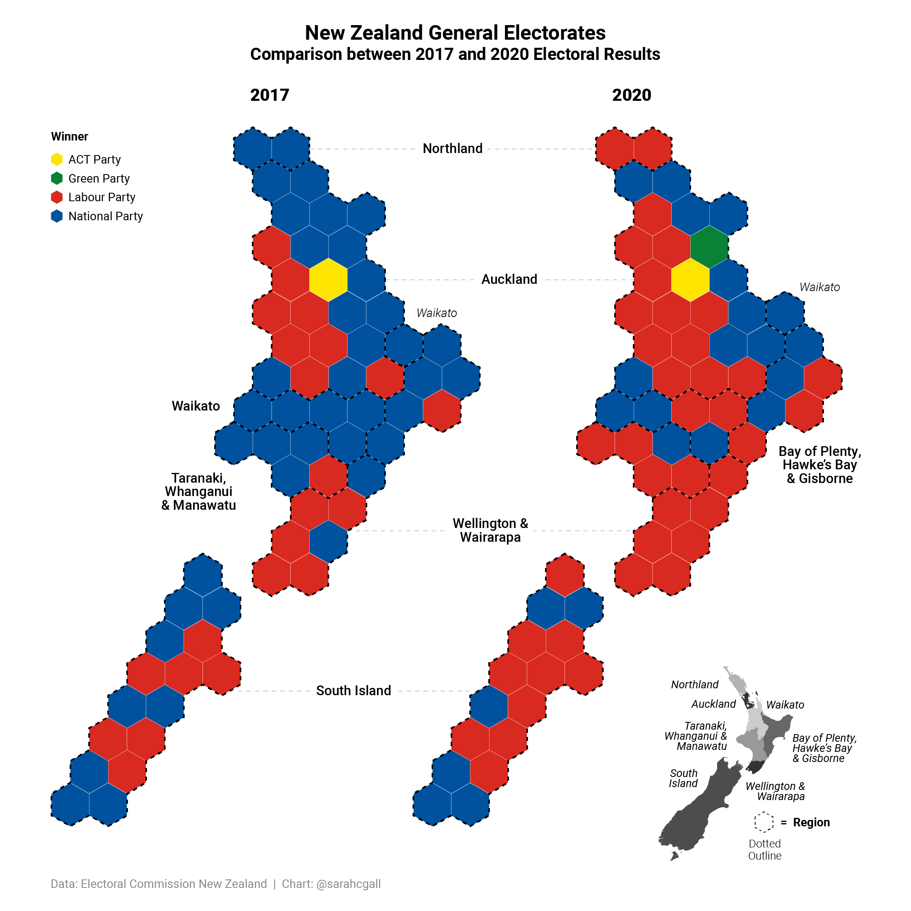

```{=html}
<style>
  .content h3 {
    margin-top: -30px !important;
  }

  details {
    margin-bottom: 40px;
  }
</style>
```
```{r, include = FALSE}
knitr::opts_chunk$set(
  collapse = TRUE,
  comment = "#>"
)
```

On the 14th of October 2023, New Zealand held their general election. Overall, 78.2% of voters turned out to vote. The results were officially declared by the Electoral Commission on the 3rd of November 2023, after the counting of special votes (votes cast overseas or out of a voter's electorate) had taken place.

```{r Seats, eval = TRUE, echo=FALSE, out.width = '100%'}

```

Overall, the centre-right National Party won the most number of seats (49 including Port Waikato at the subsequent by-election). This was not enough for the party to govern on its own in the 123 seat parliament which included 3 overhang seats. As such, the National Party formed a coalition with the right-wing ACT Party and the populist NZ First Party. This coalition was formalised on the 24th of November, giving the new coalition government 68 seats in parliament.

```{r Cartogram, eval = TRUE, echo=FALSE, out.width = '100%'}
knitr::include_graphics("../img/results23_Cartogram.png")
```

Of the 72 electorate seats, the National Party dominated, winning 44 seats (61%) - many of which were lost to Labour at the 2020 election. In the Maori electorates, Te Pati Maori also dominated, winning all but one seat. Additionally, the Greens and ACT performed well, winning 3 and 2 seats, respectively.

```{r CandidateVsParty, eval = TRUE, echo=FALSE, out.width = '100%'}
knitr::include_graphics("../img/results23_CandidateVsParty.png")
```

There was a noticeable difference between the candidate and party votes. The two major parties performed better in their candidate vote than their party vote. The reverse was true for minor parties which performed well in the party vote with ACT, NZ First and Green achieving either the 5% eligibility threshold.

```{r SplitVoting, eval = TRUE, echo=FALSE, out.width = '100%'}

```

A total of 35.51% of voters split their vote (i.e., cast their candidate vote for a different party to their party vote). The greatest split can be seen from the two major parties with a large proportion of Labour Party voters voting for the Green Party in their party vote and National Party voters, voting for the ACT Party. NZ First received party votes from both Labour and National party voters.

```{r PartyVote, eval = TRUE, echo=FALSE, out.width = '100%'}
knitr::include_graphics("../img/results_PartyVote.png")
```
Compared with the previous elections, the 2023 party vote did appear to be similar to the 1996 general election which also appeared to show a rejection of the two major parties. In fact, just over 1 in 3 voters voted for a minor party instead of the two major parties.

```{r MoV, eval = TRUE, echo=FALSE, out.width = '100%'}
knitr::include_graphics("../img/results_MoV.png")
```

Comparing the candidate vote in each general electorate, the margin of victory appears to show a swing back towards the 2017 results for the National Party, recovering what they lost in 2020 from the Labour Party.

```{r MoV1, eval = TRUE, echo=FALSE, out.width = '100%'}
knitr::include_graphics("../img/results_MoV1.png")
```

Many of Labour's safe seats however, are now considered marginal and overall have a lower margin of victory than compared to their 2017 results.

```{r MoV2, eval = TRUE, echo=FALSE, out.width = '100%'}
knitr::include_graphics("../img/results_MoV2.png")
```

Compared with 2020, all but two swing seats went to the National Party.

```{r MoV3, eval = TRUE, echo=FALSE, out.width = '100%'}
knitr::include_graphics("../img/results_MoV3.png")
```

The bellwether seats of Hamilton West, Maungakiekie, and Otaki all turned National. (NB In 2017, National had the higher vote share than Labour. Bellwethers have therefore been selected based on turning National in 2017 despite Labour forming government).

```{r MoV4, eval = TRUE, echo=FALSE, out.width = '100%'}
knitr::include_graphics("../img/results_MoV4.png")
```

In 2023, the electorates of New Lynn and Mt Roskill turned blue for the first time in MMP-history. The relatively new electorate of Takanini also turned blue.

```{r MoV5, eval = TRUE, echo=FALSE, out.width = '100%'}
knitr::include_graphics("../img/results_MoV5.png")
```

National also won back Whangarei, Ilam, and Northland which they lost in 2020 for the first to Labour. While Nelson had a swing back towards National, it was not enough to win back the seat in 2023.

```{r MoV6, eval = TRUE, echo=FALSE, out.width = '100%'}

```

The number of non-classic seats (i.e., those won not by the two major parties) increased in 2023. Previously safe Labour seats, Rongotai and Wellington Central, turned Green for the first time since 1996. The seat of Tamaki - a previously blue-ribbon seat - turned yellow for the first time.

<br>

## Pre-Election Analysis
The following was an analysis done two months prior to the election.

```{r pre_Cartogram, eval = TRUE, echo=FALSE, out.width = '100%'}

```

The cartogram shows the Labour Party's impressive number of general election gains in 2020 compared with 2017. The party dominated cities such as Auckland, Wellington, Hamilton, and Christchurch. It also won seats such as Ilam in the South Island which has been held by the National Party since 1978.

```{r pre_Pendulum, eval = TRUE, echo=FALSE, out.width = '100%'}
knitr::include_graphics("../img/pre_Pendulum.png")
```

The upcoming general election - which will be held on 14 October 2023 - is looking dire for the Labour Party. According to current polling, the party is set to lose the rare majority that it achieved in 2020.

There is, however, a potential path to victory. If the party can cauterise the bleeding of party votes before the election, it may still be able to retain a minority government in coalition with the Green Party and Te Pati Maori.

For this to occur, Labour can afford to lose no more than 19% of the party vote if the Greens and Te Pati Maori get at least 15% of the vote, cumulatively.

```{r pre_PartyVote, eval = TRUE, echo=FALSE, out.width = '100%'}

```

The issue for the National Party is that while Labour is losing a considerable number of voters, these voters are nor turning to National. Instead, there appears to be a rejection of the two major parties, with 38% of voters optiong for minor parties instead.

The polling figures are similar to the 1996 election results which saw neither party achieve a majority and need to rely on a coalition partner to form government. In the case of the 1996 election, this partner was NZ First who are currently in a similar position of being "kingmarker", sitting on a polling average of 5.8% of the party vote.

This means that we could be seeing a coalition government, consisting of the centre-right National Party, right-wing ACT Party, and populist NZ First Party, come October 14.
