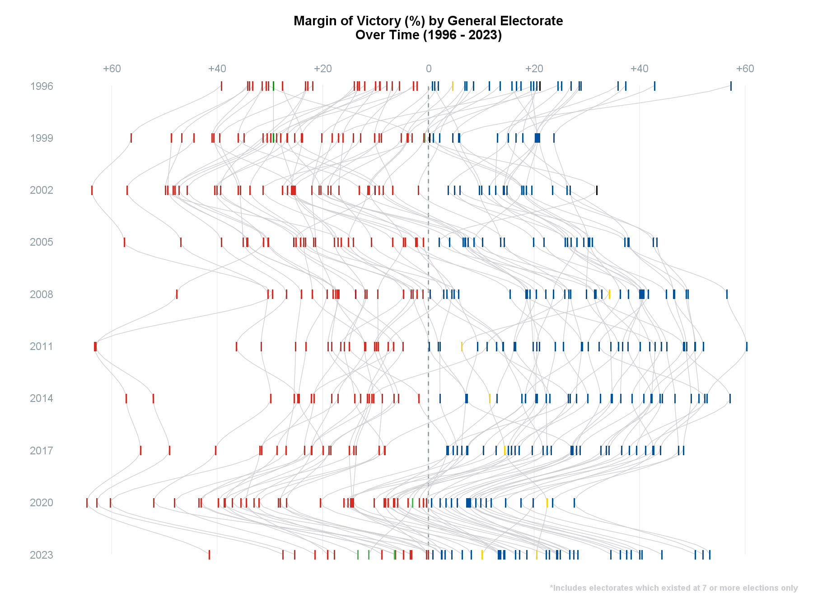

```{=html}
<style>
  .content h3 {
    margin-top: -30px !important;
  }

  details {
    margin-bottom: 40px;
  }
</style>
```
```{r, include = FALSE}
knitr::opts_chunk$set(
  collapse = TRUE,
  comment = "#>",
  eval = FALSE
)
```
<br>
This article provides examples of using each the `majority` dataset.
<br>

```{r setup, eval = TRUE, include = FALSE}
library(scgElectionsNZ)
library(tidyverse)
```
### Majority
The `majority` dataset contains the winning candidate and the margin of victory by electorate.

```{r majority}
df <- get_data("majority")
# Convert pre-2020 electorate names to match name changes that occurred in 2020
df <- update_EName(df, column=Electorate)
# Add Electorate Type and filter for General electorates only
df <- add_type(df)
df %>%
  filter(Electorate_Type == "General") %>%
  # Remove electorates that had fewer than 7 elections
  group_by(Electorate) %>%
  mutate(No. = length(Electorate)) %>%
  ungroup() %>%
  filter(No. >= 7) %>%
  mutate(Percentage = ifelse(Party %in% c("Labour Party", "Green Party",
                                          "Alliance", "Jim Anderton's Progressive"),
                             -Percentage, Percentage)) %>%
  ggplot(aes(y=Percentage, x=reorder(Election, -Election), group=Electorate, colour=Party)) +
  geom_hline(yintercept = 0, colour = scgUtils::colour_pal("Regent Grey"),
             linewidth = 0.5, linetype = "dashed") +
  geom_smooth(method = "loess",formula = 'y ~ x',
              colour = scgUtils::colour_pal("French Grey"),
              span = 0.3, se = FALSE, alpha = 0.25, linewidth = 0.25) +
  geom_point(shape='\u6c', size=4) +
  scale_y_continuous(limits = c(-70,70), expand = c(0,0), position = "right",
                     breaks = c(-60,-40,-20,0,20,40,60),
                     labels = c("+60","+40","+20","0","+20","+40","+60")
  ) +
  scale_x_discrete(expand=c(0,0)) +
  scale_colour_manual(values = scgUtils::colour_pal("polNZ")) +
  labs(title = "Margin of Victory (%) by General Electorate\nOver Time (1996 - 2023)",
       caption = "\n\n*Includes electorates which existed at 7 or more elections only",
       y = "",
       x = "") +
  coord_flip(clip = "off") +
  scgUtils::theme_scg() %+replace%
  theme(legend.position = "none",
        panel.grid.major.y = element_blank(),
        panel.grid.minor = element_blank(),
        axis.line = element_blank(),
        axis.ticks = element_blank(),
        axis.text.x.top = element_text(vjust = 4)
  )
```
```{r MarginOfVictory, eval = TRUE, echo=FALSE, out.width = '100%'}

```
