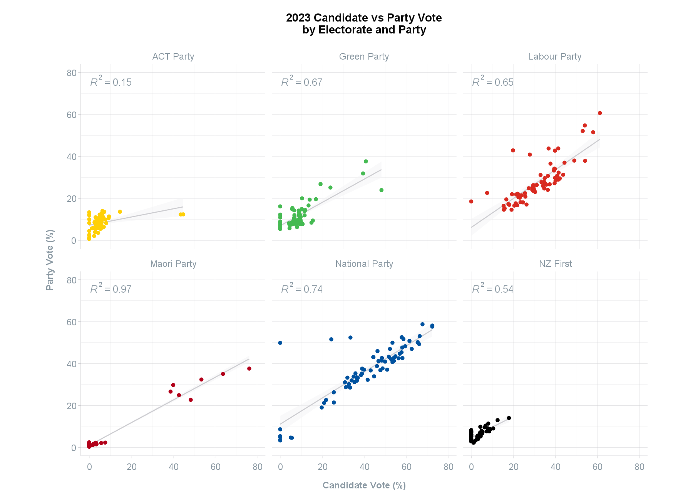

```{=html}
<style>
  .content p {
    margin-top: 30px !important;
  }

  details {
    margin-bottom: 40px;
  }
</style>
```
```{r, include = FALSE}
knitr::opts_chunk$set(
  collapse = TRUE,
  comment = "#>",
  eval = TRUE
)
```
<br>
This article explores the [`party_votes`](https://sarahcgall.github.io/scgElectionsNZ/reference/party_votes.html) and [`candidate_votes`](https://sarahcgall.github.io/scgElectionsNZ/reference/candidate_votes.html) datasets.
<br>

```{r setup, include = FALSE}
library(scgElectionsNZ)
library(dplyr)
library(ggplot2)
```
### Party and Candidate Votes
The `party_votes` and `candidate_votes` datasets contain party and candidate votes, respectively, by electorate and party. Currently, the `party_votes` has all parties listed, including the informal vote, while the `candidate_votes` have only the successful parties listed with the remaining parties listed as "Other". The informal vote is also not included.

Future updates to the `candidate_votes` dataset will replicate the `party_votes` dataset so that the "Other" category is broken down into all parties and the informal vote is included.
<br>
<br>

#### Upload data
View the shape of data frame.

***Party Votes***
```{r party-votes}
df <- scgUtils::get_data("party_votes")
head(df)
```

***Candidate Votes***
```{r candidate-votes}
df1 <- scgUtils::get_data("candidate_votes")
head(df1)
```
<br>

#### Merging datasets
Merge the two candidate and party vote datasets together in a long form data frame.
```{r party-candidate-votes}
df <- df %>%
  mutate(Party = ifelse(Party %in% c("Labour Party", "National Party", "Green Party",
                                     "ACT Party", "NZ First", "Maori Party"), Party,
                        "Other")) %>%
  group_by(Election, Electorate, Ballot, Party) %>%
  summarise(Votes = sum(Votes), .groups = 'drop') %>%
  ungroup() %>%
  group_by(Election, Electorate, Ballot) %>%
  mutate(Percentage = Votes / sum(Votes) * 100) %>%
  ungroup()

df2 <- rbind(df, df1)

head(df2)
```
<br>

#### Plot
Visualise the 2023 candidate vote by party vote in a scatter plot faceted by party.
```{r party-candidate-votes1, eval = FALSE}
df2 <- df2 %>%
  filter(Election == 2023) %>%
  mutate(Ballot = ifelse(Ballot == "Party", "Party Vote", "Candidate Vote")) %>%
  select(Election, Ballot, Electorate, Party, Percentage) %>%
  tidyr::pivot_wider(names_from = Ballot, values_from = Percentage)

df2[is.na(df2)] <- 0

df2 %>%
  filter(Party != "Other") %>%
  ggplot(aes(x = `Candidate Vote`, y = `Party Vote`, colour = Party)) +
  geom_smooth(method = "lm", se = TRUE, formula = y ~ x,
              colour = scgUtils::colour_pal("French Grey"),
              size = 0.5, fill = "#F4F4F5", alpha = 0.5) +
  geom_point() +
  ggpmisc::stat_poly_eq(colour = scgUtils::colour_pal("Regent Grey")) +
  facet_wrap(. ~ Party) +
  scale_colour_manual(values = scgUtils::colour_pal("polNZ")) +
  coord_equal(ylim = c(0, 80), xlim = c(0, 80)) +
  labs(title = "2023 Candidate vs Party Vote\nby Electorate and Party",
       y = "Party Vote (%)\n",
       x = "Candidate Vote (%)") +
  scgUtils::theme_scg() +
  theme(legend.position = "none")
```
```{r CandidateByParty, echo=FALSE, out.width = '100%'}

```
