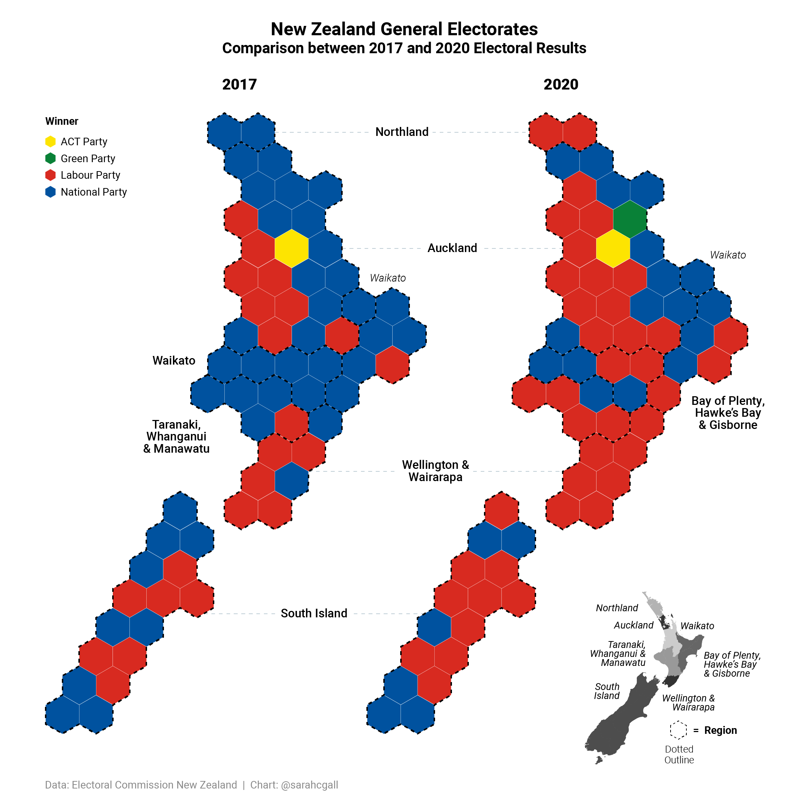
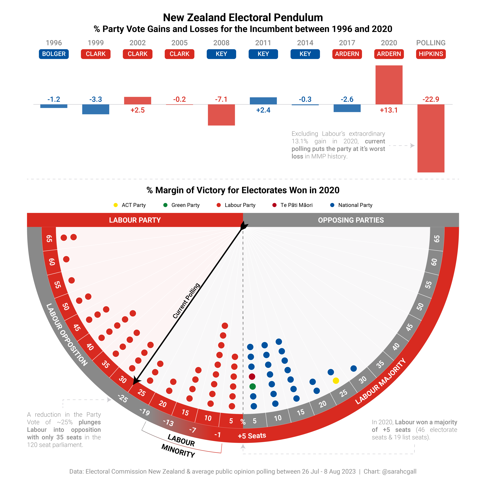
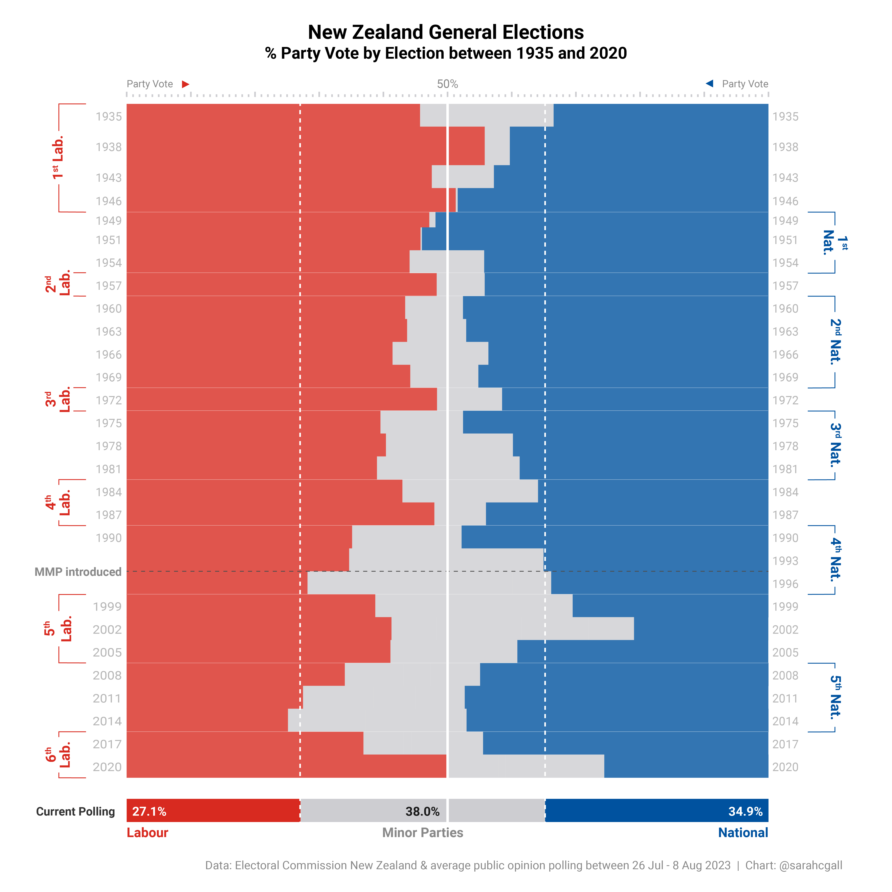

```{=html}
<style>
  .content p {
    margin-top: 30px !important;
  }

  details {
    margin-bottom: 40px;
  }
</style>
```
```{r, include = FALSE}
knitr::opts_chunk$set(
  collapse = TRUE,
  comment = "#>",
  eval = TRUE,
  echo = FALSE
)
```
<br>

The following was an analysis done two months prior to the election. The visualisations first appeared in an [article](https://conservativehome.com/2023/08/23/api-dawson-labours-collapse-could-see-an-historically-strong-result-for-the-smaller-parties-in-the-new-zealand-election/) in Conservative Home on 23 August 2023.

```{r pre_Cartogram, out.width = '100%'}

```

The cartogram shows the Labour Party's impressive number of general election gains in 2020 compared with 2017. The party dominated cities such as Auckland, Wellington, Hamilton, and Christchurch. It also won seats such as Ilam in the South Island which has been held by the National Party since 1978.

```{r pre_Pendulum, out.width = '100%'}

```

The upcoming general election - which will be held on 14 October 2023 - is looking dire for the Labour Party. According to current polling, the party is set to lose the rare majority that it achieved in 2020.

There is, however, a potential path to victory. If the party can cauterise the bleeding of party votes before the election, it may still be able to retain a minority government in coalition with the Green Party and Te Pati Maori.

For this to occur, Labour can afford to lose no more than 19% of the party vote if the Greens and Te Pati Maori get at least 15% of the vote, cumulatively.

```{r pre_PartyVote, out.width = '100%'}

```

The issue for the National Party is that while Labour is losing a considerable number of voters, these voters are nor turning to National. Instead, there appears to be a rejection of the two major parties, with 38% of voters optiong for minor parties instead.

The polling figures are similar to the 1996 election results which saw neither party achieve a majority and need to rely on a coalition partner to form government. In the case of the 1996 election, this partner was NZ First who are currently in a similar position of being "kingmarker", sitting on a polling average of 5.8% of the party vote.

This means that we could be seeing a coalition government, consisting of the centre-right National Party, right-wing ACT Party, and populist NZ First Party, come October 14.
