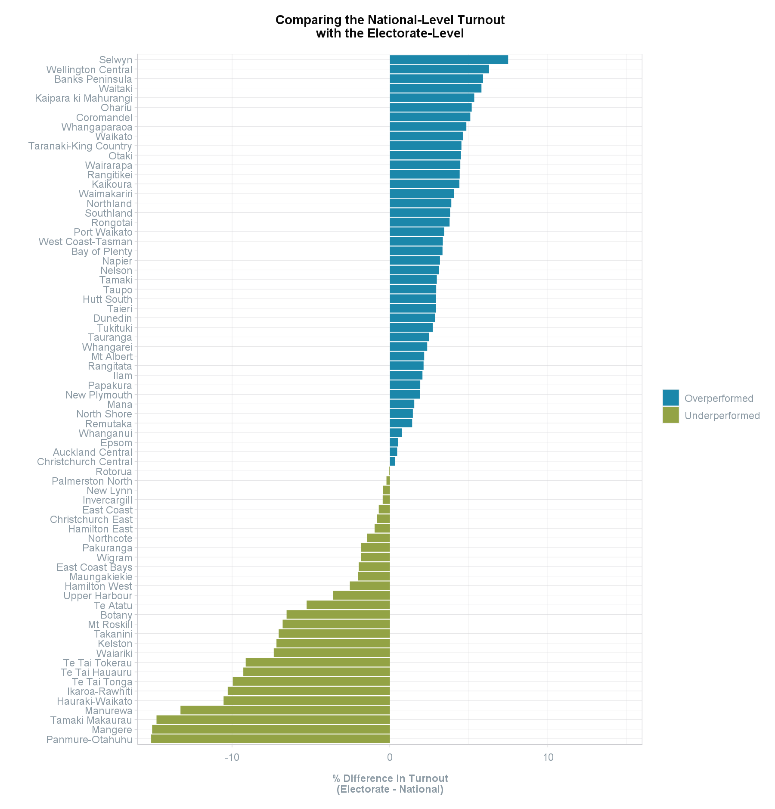
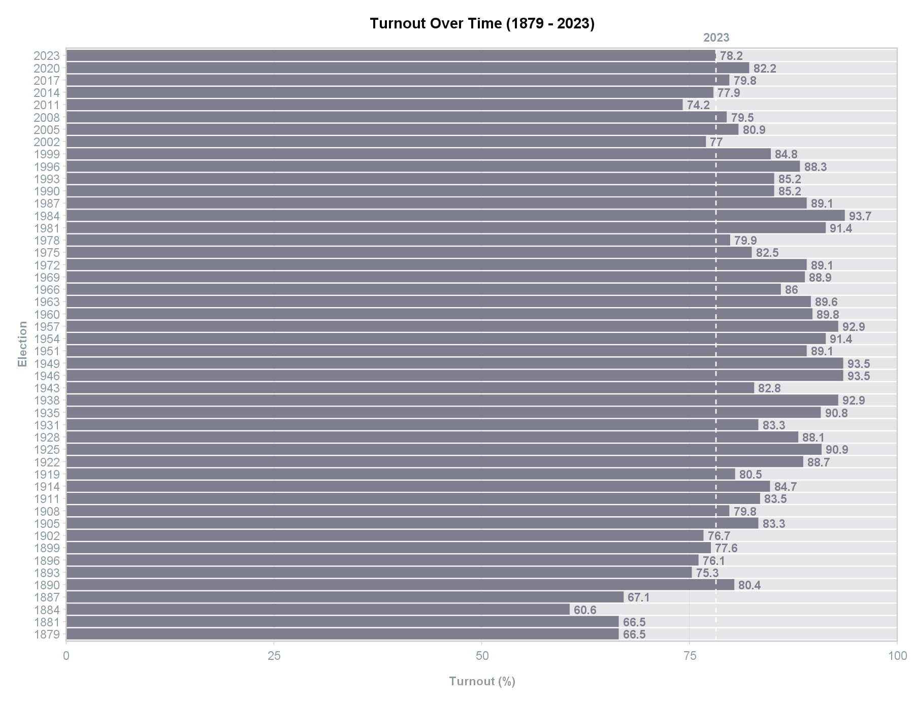

```{=html}
<style>
  .content p {
    margin-top: 30px !important;
  }

  details {
    margin-bottom: 40px;
  }
</style>
```
```{r, include = FALSE}
knitr::opts_chunk$set(
  collapse = TRUE,
  comment = "#>",
  eval = TRUE
)
```
<br>
This article explores the `turnout` and `turnout_historic` datasets.
<br>

```{r setup, include = FALSE}
library(scgElectionsNZ)
library(tidyverse)
```
### Turnout
The `turnout` dataset contains the overall turnout and informal vote by electorate and ballot type (Candidate and Party).
It also has the total vote (informal + valid) and total number of electors in the election.

This dataset can be combined with the `turnout_historic` dataset which contains the overall turnout at the
national-level for all elections between 1879 and 2023. It also contains the total number of MPs in parliament for that
election, and the total number of electors.
<br>
<br>

#### Upload data
View the shape of data frame.
```{r turnout}
df <- get_data("turnout")
head(df)
```
<br>

#### Merge datasets
Add the national-level dataset to the electorate-level to compare the difference.
```{r turnout1}
df1 <- get_data("turnout_historic")
df2 <- left_join(df, df1, by = "Election")

df2 <- df2 %>%
  filter(Ballot == "Party", Election == 2023) %>%
  mutate(Turnout = Turnout.x - Turnout.y)

head(df2)
```
<br>

#### Plot
Visualise if the electorate turnout was above or below the average turnout for that election year (2023).
```{r turnout2, eval = FALSE}
df2 %>%
  ggplot(aes(x=Turnout, y=reorder(Electorate, Turnout), fill = ifelse(Turnout < 0,
                                                                      "Underperformed",
                                                                      "Overperformed"))) +
  geom_bar(stat = "identity") +
  scale_fill_manual(values = scgUtils::colour_pal("divBlueGreen", n = 2)) +
  scale_x_continuous(limits = c(-16,16), expand = c(0,0)) +
  labs(title = "Comparing the National-Level Turnout\nwith the Electorate-Level",
       fill = "",
       y = "",
       x = "% Difference in Turnout\n(Electorate - National)") +
  scgUtils::theme_scg() +
  theme(panel.border = element_rect(colour=scgUtils::colour_pal("French Grey")))
```
```{r TurnoutByElectorate, echo=FALSE, out.width = '100%'}

```
<br>

### Turnout (Historic)
#### Upload data
View the shape of data frame.
```{r turnout-over-time}
head(df1)
```
<br>

#### Plot
Visualise turnout over time to see how 2023 compares.
```{r turnout-over-time1, eval = FALSE}
df1 %>%
  ggplot(aes(x = as.character(Election), y = Turnout, label = Turnout)) +
  geom_bar(data=df1,
           aes(x = as.character(Election), y = 100),
           stat = "identity",
           fill = scgUtils::colour_pal("French Grey"),
           alpha=0.5) +
  geom_bar(stat = "identity",
           fill = scgUtils::colour_pal("Waterloo")) +
  geom_hline(yintercept = df1$Turnout[df1$Election == 2023],
             colour = "white", linetype = "dashed") +
  geom_text(hjust = 0, nudge_y = 0.5, size = 3.5, fontface=2,
            colour = scgUtils::colour_pal("Waterloo")) +
  coord_flip(clip = "off", xlim = c(1,length(df1$Election))) +
  annotate("text", x=length(df1$Election)+1.5,
           y = df1$Turnout[df1$Election == 2023],
           label = "2023",
           colour = scgUtils::colour_pal("Regent Grey"),
           size=3.5, fontface=2) +
  scale_y_continuous(limits = c(0,100), expand = c(0,0)) +
  labs(title = "Turnout Over Time (1879 - 2023)",
       y = "Turnout (%)",
       x = "Election") +
  scgUtils::theme_scg() +
  theme(panel.grid.major.y = element_blank(),
        panel.grid.minor = element_blank(),
        panel.border = element_rect(colour=scgUtils::colour_pal("French Grey")))
```
```{r TurnoutHistoric, echo=FALSE, out.width = '100%'}

```
