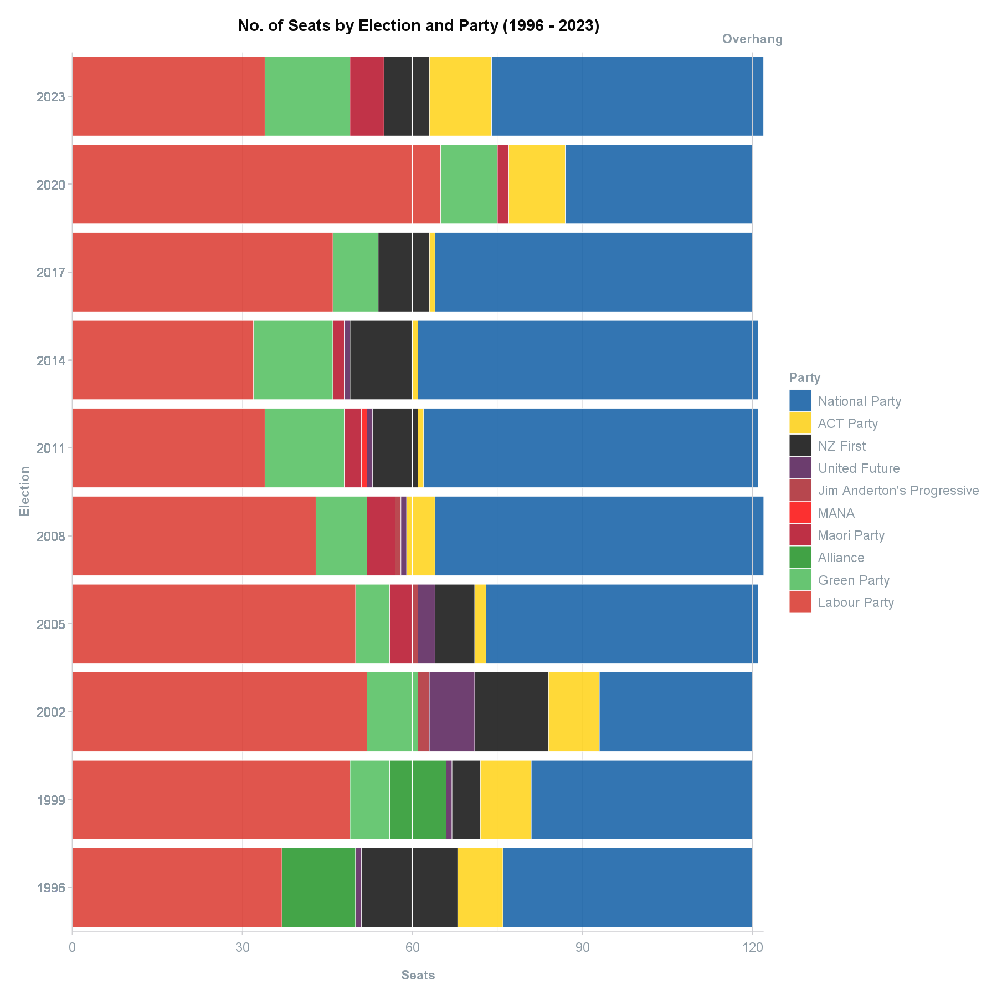
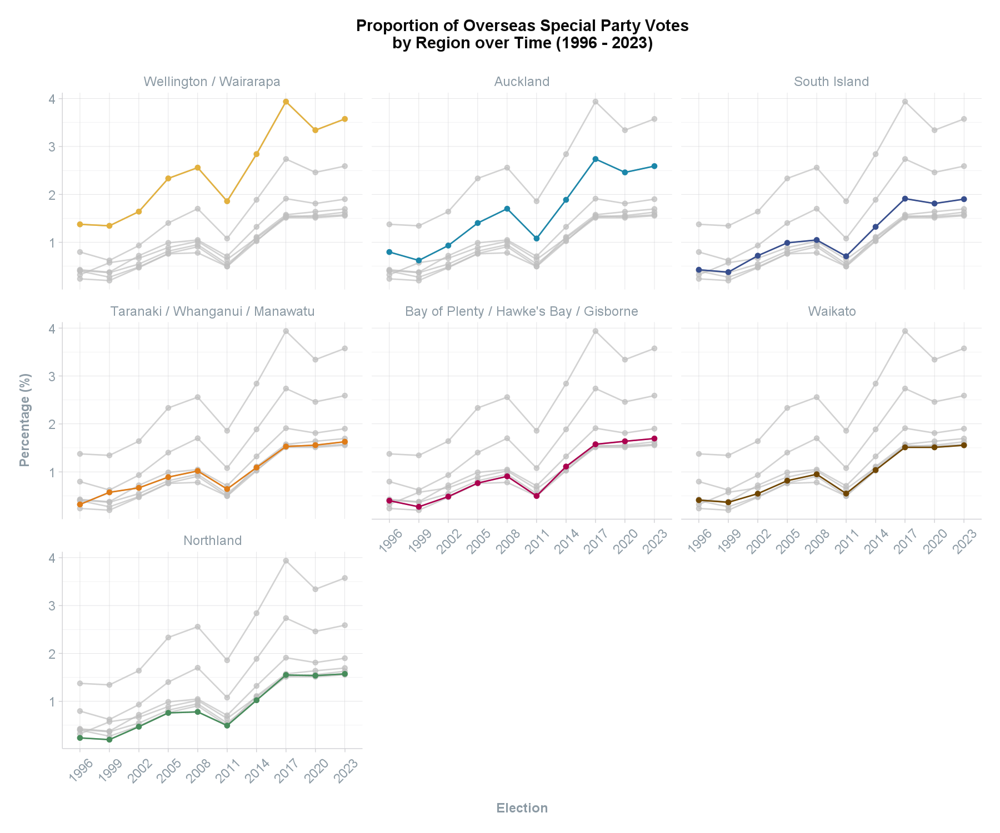
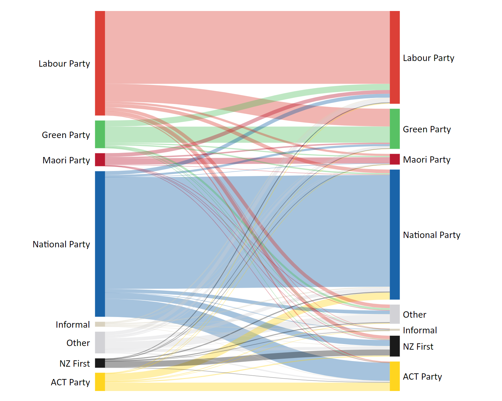

```{=html}
<style>
  .content h3 {
    margin-top: -30px !important;
  }

  details {
    margin-bottom: 40px;
  }
</style>
```
```{r, include = FALSE}
knitr::opts_chunk$set(
  collapse = TRUE,
  comment = "#>",
  eval = FALSE
)
```

<br>
This article provides examples of using each dataset included in the `scgElectionsNZ` package.
<br>

```{r setup, eval = TRUE, include = FALSE}
library(scgElectionsNZ)
library(tidyverse)
```

### Summary
The `summary` dataset contains the overall results at the national-level by Election, Ballot,
and Party. It can be used to find the number of seats, votes (n & %), and nominations/on party list by ballot type -
Candidate Vote, Party Vote, or Total (Seats column = Candidate + Party; Vote column = Party only). It can also be used to
find the number of overhang seats and which party these can be attributed to.

*NB overhang seats occur when the Party Vote entitles that party to fewer seats than the number of electorate seats that it won.*
<br>
<br>
**View the Party Vote and Candidate Vote for 2023:**
```{r summary1, eval = TRUE}
# Load datasets by using the following helper function:
df <- get_data("summary")
# Alternatively, use: data("summary")

df %>%
  filter(Ballot != "Total", Election == 2023) %>%
  arrange(-Percentage) %>%
  head(n = 10)
```
<br>

**View the Party Vote (%) of successful parties only to determine where the overhang seats in 2023 can be attributed to:**
```{r summary2, eval = TRUE}
df %>%
  filter(Successful == "Yes", Ballot == "Total", Election == 2023) %>%
  group_by(Election) %>%
  mutate(`%` = Votes/sum(Votes)*100) %>%
  ungroup() %>%
  mutate(Overhang = Seats-round(120*`%`/100,0))
```
<br>

**Plot the number of seats won by party at each election:**
```{r summary3}
df %>%
  # remove parties which did not win a seat
  filter(Successful == "Yes", Ballot == "Total") %>%
  ggplot(aes(x = Election, y = Seats,
             fill = factor(Party, levels = c("National Party","ACT Party","NZ First",
                                             "United Future","Jim Anderton's Progressive",
                                             "MANA","Maori Party","Alliance","Green Party",
                                             "Labour Party")))) +
  geom_bar(stat="identity", colour="white", linewidth=0.15, alpha=0.8) +
  # indicate majority required for a 120 seat parliament
  geom_hline(yintercept = 60, colour = "white", linewidth=0.5) +
  # indicate overhang seats
  geom_hline(yintercept = 120, colour = scgUtils::colour_pal("French Grey")) +
  annotate("text", x=2025, y =120, label = "Overhang",
           colour = scgUtils::colour_pal("Regent Grey"),
           size=3.5, fontface=2) +
  coord_flip(clip = "off", xlim = c(1994.5,2024.5)) +
  labs(title = "No. of Seats by Election and Party (1996 - 2023)",
       fill = "Party") +
  scale_fill_manual(values = scgUtils::colour_pal("polNZ")) +
  scale_y_continuous(expand = c(0,0)) +
  scale_x_continuous(expand = c(0,0), "Election",
                     labels = as.character(df$Election), breaks = df$Election) +
  scgUtils::theme_scg() +
  theme(panel.grid.major.y = element_blank(),
        panel.grid.minor.y = element_blank())
```
```{r SeatsByElection, eval = TRUE, echo=FALSE, out.width = '100%'}

```
This dataset can be combined with the `preMMP_results` dataset which contains the overall results between 1890 and 1993
by party at the national-level.

```{r preMMP}
df <- df %>%
  filter(Ballot == "Total") %>%
  mutate(Party = ifelse(Successful == "Yes", Party, "Other")) %>%
  group_by(Election, Party) %>%
  summarise(Seats = sum(Seats), Votes = sum(Votes), .groups = 'drop') %>%
  ungroup() %>%
  group_by(Election) %>%
  mutate(Percentage = round(Votes/sum(Votes)*100),2) %>%
  ungroup() %>%
  select(Election, Party, Seats, Percentage)
df1 <- get_data("preMMP_results")
df2 <- rbind(df, df1)

df2 <- df2 %>%
  # filter 1935 until current time (since the beginning of the National and Labour parties)
  filter(Election >= 1935) %>%
  mutate(Party = ifelse(Party %in% c("National Party", "Labour Party"), Party,
                 ifelse(Party == "United-Reform ('National')", "National Party",
                        "Other")),
         Party = factor(Party, levels = c("National Party", "Other", "Labour Party"))) %>%
  group_by(Election, Party) %>%
  summarise(Percentage = round(sum(Percentage),2), .groups = 'drop') %>%
  ungroup()

df2 %>%
  ggplot(aes(x = reorder(Election, -Election), y = Percentage,
             fill = Party)) +
  geom_bar(stat = "identity", alpha = 0.8, width = 1, size = 0) +
  geom_bar(data = df2%>%filter(Election == 2023), aes(x = 1, y = Percentage, fill = Party),
           stat = "identity", alpha = 1, width = 1) +
  # Add 50% line
  geom_hline(yintercept = 50, colour = "white") +
  annotate("text", x = 31.2, y = 50, label = "50%", size = 3.5, fontface = 2,
           colour = scgUtils::colour_pal("Regent Grey")) +
  annotate("text", x = 31.2, y = 0, label = "Party Vote >", size = 3, fontface = 2,
           colour = scgUtils::colour_pal("Regent Grey"), hjust = 0) +
  annotate("text", x = 31.2, y = 100, label = "< Party Vote", size = 3, fontface = 2,
           colour = scgUtils::colour_pal("Regent Grey"), hjust = 1) +
  # Add dashed lines for 2023 result
  geom_hline(yintercept = df2$Percentage[df2$Election == 2023 & df2$Party == "Labour Party"],
             colour = "white", linewidth = 0.5, linetype = "dashed") +
  geom_hline(yintercept = 100-df2$Percentage[df2$Election == 2023 & df2$Party == "National Party"],
             colour = "white", linewidth = 0.5, linetype = "dashed") +
  # Add introduction of MMP line
  geom_vline(xintercept = 10.5, colour = scgUtils::colour_pal("Black80"),
             linetype = "dashed", linewidth = 0.25) +
  annotate("text", x = 10.5, y = 100.75, label = "MMP introduced", size = 3.5, fontface = 2,
           colour = scgUtils::colour_pal("Black80"), hjust = 0) +
  # Add text to 2023 result
  geom_text(x = 1, y = 1,
            label = paste0(df2$Percentage[df2$Election == 2023 & df2$Party == "Labour Party"], "%"),
            hjust = 0, size = 3, colour = "white") +
  annotate("text", x = 0, y = 0, label = "Labour", size = 3.5, fontface = 2,
           colour = "#D82A20", hjust = 0) +
  geom_text(x = 1, y = df2$Percentage[df2$Election == 2023 & df2$Party == "Labour Party"]+
    (df2$Percentage[df2$Election == 2023 & df2$Party == "Other"]/2),
            label = paste0(format(df2$Percentage[df2$Election == 2023 & df2$Party == "Other"],
                                  nsmall=2), "%"),
            hjust = 0.5, size = 3, colour = scgUtils::colour_pal("Black80")) +
  annotate("text", x = 0, y = df2$Percentage[df2$Election == 2023 & df2$Party == "Labour Party"]+
    (df2$Percentage[df2$Election == 2023 & df2$Party == "Other"]/2),
           label = "Minor Parties", size = 3.5, fontface = 2,
           colour = scgUtils::colour_pal("Regent Grey"), hjust = 0.5) +
  geom_text(x = 1, y = 99,
            label = paste0(df2$Percentage[df2$Election == 2023 & df2$Party == "National Party"], "%"),
            hjust = 1, size = 3, colour = "white") +
  annotate("text", x = 0, y = 100,
           label = "National", size = 3.5, fontface = 2,
           colour = "#00529F", hjust = 1) +
  labs(title = "% Party Vote by Election between 1935 and 2023") +
  scale_y_continuous(expand = c(0,0), position = "right",
                     breaks = seq(0, 100, by = 5)) +
  scale_fill_manual(values = scgUtils::colour_pal("polNZ")) +
  coord_flip(clip = "off", xlim = c(1,30), ylim = c(0,100.25)) +
  scgUtils::theme_scg() +
  theme(legend.position = "none",
        plot.margin = unit(c(1,3,1,1), "cm"),
        plot.title = element_text(vjust = 5, colour = scgUtils::colour_pal("Black80")),
        panel.grid.major = element_blank(),
        panel.grid.minor = element_blank(),
        axis.line = element_blank(),
        axis.ticks.y = element_blank(),
        axis.title.x = element_blank(),
        axis.title.y = element_blank(),
        axis.text.x = element_blank()
  )
```
```{r PartyVoteByElection, eval = TRUE, echo=FALSE, out.width = '100%'}
knitr::include_graphics("img/plot_PartyVoteByElection.png")
```

### Turnout
The `turnout` dataset contains the overall turnout and informal vote by electorate and ballot type (Candidate and Party).
It also has the total vote (informal + valid) and total number of electors in the election.

This dataset can be combined with the `historic_turnout` dataset which contains the overall turnout at the
national-level for all elections between 1879 and 2023. It also contains the total number of MPs in parliament for that
election, and the total number of electors.
<br>
<br>
**Compare electorate-level turnout to national-level:**
```{r turnout}
df <- get_data("turnout")
df1 <- get_data("historic_turnout")
df2 <- left_join(df, df1, by = "Election")

df2 <- df2 %>%
  filter(Ballot == "Party", Election == 2023) %>%
  mutate(Turnout = Turnout.x - Turnout.y)

df2 %>%
  ggplot(aes(x=Turnout, y=reorder(Electorate, Turnout), fill = ifelse(Turnout < 0,
                                                                      "Underperformed",
                                                                      "Overperformed"))) +
  geom_bar(stat = "identity") +
  scale_fill_manual(values = scgUtils::colour_pal("divBlueGreen", n = 2)) +
  scale_x_continuous(limits = c(-16,16), expand = c(0,0)) +
  labs(title = "Comparing the National-Level Turnout\nwith the Electorate-Level",
       fill = "",
       y = "",
       x = "% Difference in Turnout\n(Electorate - National)") +
  scgUtils::theme_scg() +
  theme(panel.border = element_rect(colour=scgUtils::colour_pal("French Grey")))
```
```{r TurnoutByElectorate, eval = TRUE, echo=FALSE, out.width = '100%'}
knitr::include_graphics("img/plot_TurnoutByElectorate.png")
```
<br>

**View turnout over time to see how 2023 compares:**
```{r turnout-over-time}
df1 %>%
  ggplot(aes(x = as.character(Election), y = Turnout, label = Turnout)) +
  geom_bar(data=df1,
           aes(x = as.character(Election), y = 100),
           stat = "identity",
           fill = scgUtils::colour_pal("French Grey"),
           alpha=0.5) +
  geom_bar(stat = "identity",
           fill = scgUtils::colour_pal("Waterloo")) +
  geom_hline(yintercept = df1$Turnout[df1$Election == 2023],
             colour = "white", linetype = "dashed") +
  geom_text(hjust = 0, nudge_y = 0.5, size = 3.5, fontface=2,
            colour = scgUtils::colour_pal("Waterloo")) +
  coord_flip(clip = "off", xlim = c(1,length(df1$Election))) +
  annotate("text", x=length(df1$Election)+1.5,
           y = df1$Turnout[df1$Election == 2023],
           label = "2023",
           colour = scgUtils::colour_pal("Regent Grey"),
           size=3.5, fontface=2) +
  scale_y_continuous(limits = c(0,100), expand = c(0,0)) +
  labs(title = "Turnout Over Time (1879 - 2023)",
       y = "Turnout (%)",
       x = "Election") +
  scgUtils::theme_scg() +
  theme(panel.grid.major.y = element_blank(),
        panel.grid.minor = element_blank(),
        panel.border = element_rect(colour=scgUtils::colour_pal("French Grey")))
```
```{r TurnoutHistoric, eval = TRUE, echo=FALSE, out.width = '100%'}
knitr::include_graphics("img/plot_TurnoutHistoric.png")
```

### Vote Type
The `vote_type` dataset contains the validity of the vote (Disallowed, Informal, and Valid) and the vote type (Ordinary,
Special - NZ, and Special - Overseas) by electorate and ballot type (Candidate and Party).
<br>
<br>
**View percent of disallowed votes by electorate and ballot:**
```{r vote-type1, eval = TRUE}
df <- get_data("vote_type")

df %>%
  filter(Election == 2023) %>%
  group_by(Ballot, Electorate, Validity) %>%
  summarise(Votes = sum(Votes), .groups = 'drop') %>%
  ungroup() %>%
  group_by(Ballot, Electorate) %>%
  mutate(Percentage = Votes/sum(Votes)*100) %>%
  ungroup() %>%
  filter(Validity == "Disallowed") %>%
  arrange(-Percentage) %>%
  head(n = 10)
# ...
```
<br>

**View percentage of voters overseas by electorate:**
```{r vote-type2, eval = TRUE}
df %>%
        # including only valid and informal votes
  filter(Election == 2023, Validity != "Disallowed") %>%
  group_by(Ballot, Electorate, Vote_Type) %>%
  summarise(Votes = sum(Votes), .groups = 'drop') %>%
  ungroup() %>%
  group_by(Ballot, Electorate) %>%
  mutate(Percentage = Votes/sum(Votes)*100) %>%
  ungroup() %>%
  filter(Vote_Type == "Special - Overseas") %>%
  arrange(-Percentage) %>%
  head(n = 10)
```
<br>

**Add a region column to dataset::**
```{r vote-type3}
df <- add_region(df)
df <- df %>%
   # including only valid and informal votes
  filter(Ballot == "Party", Validity != "Disallowed") %>%
  group_by(Election, Region, Vote_Type) %>%
  summarise(Votes = sum(Votes), .groups = 'drop') %>%
  ungroup() %>%
  group_by(Election, Region) %>%
  mutate(Percentage = Votes/sum(Votes)*100) %>%
  ungroup() %>%
  filter(Vote_Type == "Special - Overseas") %>%
  arrange(-Percentage)

df %>%
  ggplot(aes(x=as.character(Election), y=Percentage, group=Region, colour=Region)) +
  geom_line() +
  geom_point() +
  gghighlight::gghighlight(use_direct_label = F) +
  facet_wrap(.~reorder(Region, -Percentage)) +
  scale_colour_manual(values = c("#374e8e", "#e3b13e", "#df7c18", "#ac004f",
                                 "#704600", "#1b87aa", "#478c5b"),
                      breaks = c("South Island", "Wellington / Wairarapa",
                                 "Taranaki / Whanganui / Manawatu",
                                 "Bay of Plenty / Hawke's Bay / Gisborne",
                                 "Waikato", "Auckland", "Northland")) +
  labs(title = "Proportion of Overseas Special Party Votes\nby Region over Time (1996 - 2023)",
       y = "Percentage (%)\n",
       x = "Election") +
  scgUtils::theme_scg() +
  theme(axis.text.x = element_text(angle = 45, vjust = 0.5),
        legend.position = "none")
```
```{r OverseasVotes, eval = TRUE, echo=FALSE, out.width = '100%'}

```

### Party and Candidate Votes
The `party_votes` and `candidate_votes` datasets contain party and candidate votes, respectively, by electorate and party.
Currently, the `party_votes` has all parties listed, including the informal vote, while the `candidate_votes` have only the
successful parties listed with the remaining parties listed as "Other". The informal vote is also not included.

Future updates to the `candidate_votes` dataset will replicate the `party_votes` dataset so that the "Other" category is broken down into all parties and the informal vote is included.

```{r party-candidate-votes}
df <- get_data("party_votes")
df1 <- get_data("candidate_votes")

df <- df %>%
  mutate(Party = ifelse(Party %in% c("Labour Party", "National Party", "Green Party",
                                     "ACT Party", "NZ First", "Maori Party"), Party,
                        "Other")) %>%
  group_by(Election, Electorate, Ballot, Party) %>%
  summarise(Votes = sum(Votes), .groups = 'drop') %>%
  ungroup() %>%
  group_by(Election, Electorate, Ballot) %>%
  mutate(Percentage = Votes/sum(Votes)*100) %>%
  ungroup()

df2 <- rbind(df, df1)

df2 <- df2 %>%
  filter(Election == 2023) %>%
  mutate(Ballot = ifelse(Ballot == "Party", "Party Vote", "Candidate Vote")) %>%
  select(Election, Ballot, Electorate, Party, Percentage) %>%
  pivot_wider(names_from = Ballot, values_from = Percentage)

df2[is.na(df2)] <- 0

df2 %>%
  filter(Party != "Other") %>%
  ggplot(aes(x = `Candidate Vote`, y = `Party Vote`, colour = Party)) +
  geom_smooth(method = "lm", se = TRUE, formula = y ~ x,
              colour = scgUtils::colour_pal("French Grey"),
              size=0.5, fill = "#F4F4F5", alpha = 0.5) +
  geom_point() +
  ggpmisc::stat_poly_eq(colour = scgUtils::colour_pal("Regent Grey")) +
  facet_wrap(.~Party) +
  scale_colour_manual(values = scgUtils::colour_pal("polNZ")) +
  coord_equal(ylim = c(0,80), xlim = c(0,80)) +
  labs(title = "2023 Candidate vs Party Vote\nby Electorate and Party",
       y = "Party Vote (%)\n",
       x = "Candidate Vote (%)") +
  scgUtils::theme_scg() +
  theme(legend.position = "none")
```
```{r CandidateByParty, eval = TRUE, echo=FALSE, out.width = '100%'}
knitr::include_graphics("img/plot_CandidateByParty.png")
```

### Majority
The `majority` dataset contains the winning candidate and the margin of victory by electorate.

```{r majority}
df <- get_data("majority")
# Convert pre-2020 electorate names to match name changes that occurred in 2020
df <- update_EName(df, column=Electorate)
# Add Electorate Type and filter for General electorates only
df <- add_type(df)
df %>%
  filter(Electorate_Type == "General") %>%
  # Remove electorates that had fewer than 7 elections
  group_by(Electorate) %>%
  mutate(No. = length(Electorate)) %>%
  ungroup() %>%
  filter(No. >= 7) %>%
  mutate(Percentage = ifelse(Party %in% c("Labour Party", "Green Party",
                                          "Alliance", "Jim Anderton's Progressive"),
                             -Percentage, Percentage)) %>%
  ggplot(aes(y=Percentage, x=reorder(Election, -Election), group=Electorate, colour=Party)) +
  geom_hline(yintercept = 0, colour = scgUtils::colour_pal("Regent Grey"),
             linewidth = 0.5, linetype = "dashed") +
  geom_smooth(method = "loess",formula = 'y ~ x',
              colour = scgUtils::colour_pal("French Grey"),
              span = 0.3, se = FALSE, alpha = 0.25, linewidth = 0.25) +
  geom_point(shape='\u6c', size=4) +
  scale_y_continuous(limits = c(-70,70), expand = c(0,0), position = "right",
                     breaks = c(-60,-40,-20,0,20,40,60),
                     labels = c("+60","+40","+20","0","+20","+40","+60")
  ) +
  scale_x_discrete(expand=c(0,0)) +
  scale_colour_manual(values = scgUtils::colour_pal("polNZ")) +
  labs(title = "Margin of Victory (%) by General Electorate\nOver Time (1996 - 2023)",
       caption = "\n\n*Includes electorates which existed at 7 or more elections only",
       y = "",
       x = "") +
  coord_flip(clip = "off") +
  scgUtils::theme_scg() %+replace%
  theme(legend.position = "none",
        panel.grid.major.y = element_blank(),
        panel.grid.minor = element_blank(),
        axis.line = element_blank(),
        axis.ticks = element_blank(),
        axis.text.x.top = element_text(vjust = 4)
  )
```
```{r MarginOfVictory, eval = TRUE, echo=FALSE, out.width = '100%'}
knitr::include_graphics("img/plot_MarginOfVictory.png")
```

### Split Voting
The `split_total` dataset contains the number of voters who cast their party vote for a different party to their candidate
vote at the national level, by party. This dataset only has election years 2005 through to 2023 due to there not being
split-ticket voting data available for previous years.

```{r split-voting, eval = FALSE}
df <- get_data("split_total")

# Prepare Sankey Data
df <- df %>%
  filter(Year==2023) %>% # get 2023 election data only
  # combine unsuccessful minor parties into "Other" category
  mutate(List_Party = ifelse(
    List_Party %in% c("Labour Party","ACT Party","Maori Party",
                      "Green Party","National Party","NZ First",
                      "Informal"),
    List_Party, "Other"
  )) %>%
  mutate(Electorate_Party = ifelse(
    Electorate_Party %in%
      c("Labour Party","ACT Party","Maori Party","Green Party",
        "National Party","NZ First","Informal"),
    Electorate_Party, "Other"
  )) %>%
  group_by(List_Party, Electorate_Party) %>%
  summarise(Vote = sum(Votes)) %>%
  ungroup()

# A tibble: 64 x 3
#   List_Party  Electorate_Party    Vote
#   <chr>       <chr>              <dbl>
# 1 ACT Party   ACT Party         68692.
# 2 ACT Party   Green Party        2095.
# ...

# =====================================#
# Look up colours
scgUtils::colour_pal("polNZ")
# $`ACT Party`
# [1] "#ffd006"
# $`Green Party`
# [1] "#45ba52"
# ...

# Create Sankey
scgUtils::plot_sankey(
  data = df,
  source = "Electorate_Party", # left side of sankey
  target = "List_Party", # right side of sankey
  value = "Vote",
  colours = '"#ffd006","#45ba52","#d5cdb9","#D82A20","#B2001A","#000000","#00529F","#cdcdd1"',
  fontSize = 20, # reduce font size from default
  width = 1600 # increase width form default
) # %>%
  # save from viewer to html
  # htmlwidgets::saveWidget(file="sankey_2023.html", selfcontained = TRUE)

```
```{r SplitVote, eval = TRUE, echo=FALSE, out.width = '100%'}

```
